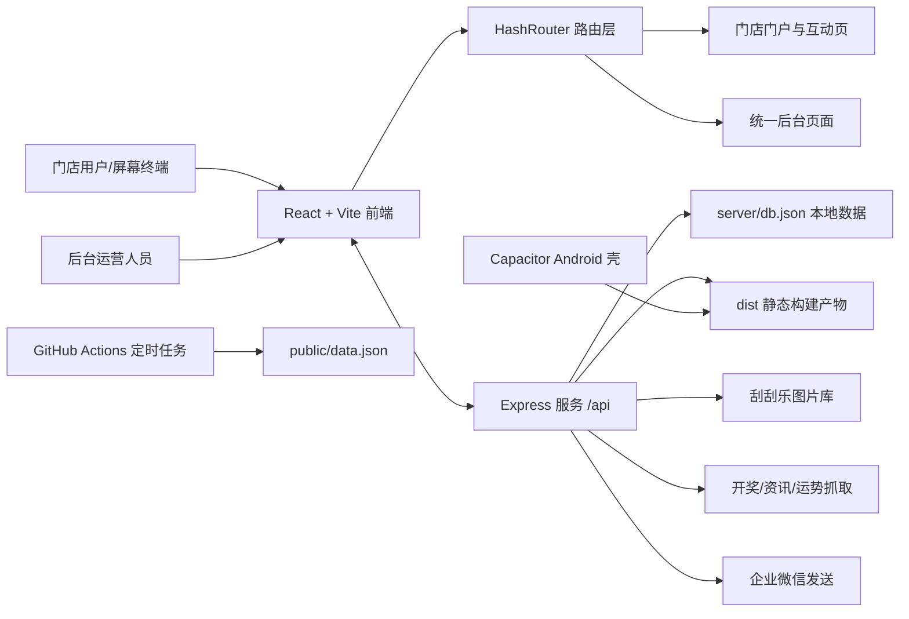

这是一套围绕**体彩门店互动展示与后台统一管理**构建的全栈项目。对初学者来说，可以先把它理解成：**一个 React 前端站点**负责展示选号、刮刮乐、门店门户和后台页面，**一个 Express 服务**负责提供 API、托管构建产物、维护本地 JSON 数据，并串联开奖历史、运势、刮刮乐票面与企业微信发送等后端能力；同时，项目还带有 **Android Capacitor 壳** 和 **GitHub Actions 定时抓取任务**，说明它不是单纯练习项目，而是面向实际运行场景的业务仓库。Sources: [软件平台与后台功能说明](软件平台与后台功能说明.md#L1-L18) [package.json](package.json#L1-L49) [server/index.js](server/index.js#L133-L171) [capacitor.config.json](capacitor.config.json#L1-L9) [.github 工作流](.github/workflows/fetch-lottery.yml#L1-L33)

你当前所在页面是“快速开始”中的第一篇，即 [项目概览](1-xiang-mu-gai-lan)。这一页的目标不是带你立即启动项目，也不是深入解释实现细节，而是先回答三个最重要的问题：**这是什么项目、它大致由哪些部分组成、你下一步应该先读哪一页**。如果你刚接手仓库，这一页相当于进入代码前的“地图页”。Sources: [src/App.jsx](src/App.jsx#L33-L78) [软件平台与后台功能说明](软件平台与后台功能说明.md#L19-L49)

## 一句话理解这个项目

从代码和说明文件可以验证，这个仓库服务的是“**智慧互动屏 + 门店门户 + 统一后台**”场景：前台面向门店展示与互动体验，后台面向运营配置与内容管理，服务端负责数据抓取、内容同步和静态资源发布。前台包含大乐透选号、计算器、刮刮乐以及多种门店门户样式；后台包含仪表盘、门店配置、中奖喜报、爬虫监控、版式管理和运势管理。Sources: [软件平台与后台功能说明](软件平台与后台功能说明.md#L7-L18) [src/App.jsx](src/App.jsx#L41-L75)

## 这套仓库由哪些部分组成

在技术层面，这个项目最适合被理解为“**前后端一体仓库**”。根目录 `package.json` 使用 Vite 作为前端开发与构建工具；`src/App.jsx` 定义了整个前端路由树；`server/index.js` 则启动 Express 服务，并同时承担 API 提供者与 `dist` 静态文件发布者的角色；`capacitor.config.json` 表明前端构建结果还能被封装进 Android 应用；而 GitHub Actions 工作流会按小时更新 `public/data.json`，说明部分数据具备自动化同步链路。Sources: [package.json](package.json#L6-L47) [src/App.jsx](src/App.jsx#L35-L78) [server/index.js](server/index.js#L139-L171) [capacitor.config.json](capacitor.config.json#L1-L9) [.github 工作流](.github/workflows/fetch-lottery.yml#L3-L33)

在业务层面，它不是“一个首页 + 一个后台”这么简单，而是包含至少三类使用者视角：**门店屏幕/终端用户**会进入门店门户、选号页和刮刮乐页；**门店或运营人员**会进入后台配置页面；**系统服务**则持续抓取开奖、运势、票面素材并将结果缓存到本地数据库或发布到前台。这样的划分有助于初学者快速建立心智模型：看到 `src/` 时想“界面与路由”，看到 `server/` 时想“数据与服务”，看到 `android/` 时想“移动端壳”，看到 `.github/workflows/` 时想“自动任务”。Sources: [src/App.jsx](src/App.jsx#L37-L75) [src/components/StoreClientLayout.jsx](src/components/StoreClientLayout.jsx#L15-L60) [server/index.js](server/index.js#L11-L17) [server/index.js](server/index.js#L173-L200)

## 架构总览

下面这张 Mermaid 图适合用来快速理解仓库的大致关系。读图时可以先抓住主线：**门店终端和后台都落在同一个前端应用里，服务端统一提供 API 与静态发布，数据既可能来自本地 JSON，也可能来自抓取任务与外部平台**。Sources: [src/App.jsx](src/App.jsx#L35-L78) [server/index.js](server/index.js#L139-L171) [server/index.js](server/index.js#L2869-L2951)



这张图对应的代码证据很直接：前端通过 `HashRouter` 组织页面；服务端既提供 `/api`，又负责返回 `dist` 中的 `index.html` 和 `data.json`；门店容器会定时向服务端发送心跳；移动端配置把 `dist` 作为 Web 目录，同时允许通过远程 URL 访问；GitHub Actions 会执行抓取脚本并提交 `public/data.json` 的更新。Sources: [src/App.jsx](src/App.jsx#L35-L78) [src/components/StoreClientLayout.jsx](src/components/StoreClientLayout.jsx#L15-L53) [server/index.js](server/index.js#L145-L171) [server/index.js](server/index.js#L2940-L2951) [capacitor.config.json](capacitor.config.json#L4-L8) [.github 工作流](.github/workflows/fetch-lottery.yml#L20-L33)

## 仓库里最值得先认识的 6 个区域

如果你第一次打开这个仓库，最容易被海量脚本、备份包和截图文件干扰。更有效的方式，是先只认识下面几个“主干目录/文件”，因为它们构成了项目最稳定的骨架。Sources: [package.json](package.json#L6-L47) [src/App.jsx](src/App.jsx#L33-L78) [server/package.json](server/package.json#L1-L24) [capacitor.config.json](capacitor.config.json#L1-L9)

| 区域 | 你可以把它理解成什么 | 为什么重要 |
|---|---|---|
| `src/` | 前端应用源码 | 包含路由、页面、后台界面、门店容器 |
| `server/` | 后端服务源码 | 提供 API、托管构建产物、维护本地数据 |
| `public/` | 前端静态资源与数据入口 | 包含 `data.json` 等前端直接消费的资源 |
| `android/` | Android 工程 | 说明项目支持移动端封装 |
| `.github/workflows/` | 自动化任务 | 用于定时抓取并更新数据 |
| `deploy/` 与大量 `deploy/check/verify` 脚本 | 部署与运维工具区 | 说明仓库包含真实部署与远程校验场景 |

从页面代码可见，`src/` 里既有用户功能页，也有后台管理页；从服务端入口可见，`server/` 不是实验脚本目录，而是正式服务入口；从工作流文件可见，数据更新已经被接入自动流程；从 Capacitor 配置可见，前端构建结果还能被封装到 Android 环境中。Sources: [src/App.jsx](src/App.jsx#L3-L27) [server/index.js](server/index.js#L133-L171) [.github 工作流](.github/workflows/fetch-lottery.yml#L25-L33) [capacitor.config.json](capacitor.config.json#L1-L9)

## 关键页面类型一览

对于初学者，理解“有哪些页面类型”比理解“每个页面怎么写”更重要。`src/App.jsx` 已经把整个系统分成了三个清晰区域：**默认入口跳转**、**统一后台**、**多门店子站点**。其中，多门店路径统一使用 `/s/:storeId/...`，后台使用 `/admin`。Sources: [src/App.jsx](src/App.jsx#L37-L75)

| 页面类型 | 路由特征 | 面向谁 | 作用概览 |
|---|---|---|---|
| 默认入口 | `/` | 所有人 | 自动跳转到默认门店 |
| 统一后台 | `/admin` | 运营/管理员 | 仪表盘、门店配置、爬虫监控、版式与运势管理 |
| 门店站点 | `/s/:storeId` | 门店终端 | 展示不同风格的门店门户 |
| 互动页面 | `/s/:storeId/lotto` `/calculator` `/scratch` | 门店用户 | 选号、计算、刮刮乐互动 |
| 兼容/实验风格页 | `style-*` | 开发/配置场景 | 切换不同门店门户样式 |

这些路由能说明一个重要特征：项目不是单一品牌官网，而是带有**多门店、多风格、多角色访问入口**的业务应用。哪怕你还没读任何后端代码，仅从路由树就能看出它同时服务“展示、互动、后台配置”三种任务。Sources: [src/App.jsx](src/App.jsx#L38-L75)

## 可视化项目结构

如果只保留“理解项目”最必要的骨架，这个仓库可以先被简化成下面这样的结构。它不是完整目录清单，而是帮助你在脑中建立层次的**学习版地图**。Sources: [package.json](package.json#L6-L47) [src/App.jsx](src/App.jsx#L3-L27) [server/package.json](server/package.json#L4-L9) [capacitor.config.json](capacitor.config.json#L1-L9) [.github 工作流](.github/workflows/fetch-lottery.yml#L1-L33)

```text
CJDLT/
├─ src/                    # React 前端：门店页、互动页、后台页
│  ├─ pages/
│  ├─ admin/
│  └─ components/
├─ server/                 # Express 服务：API、抓取、数据、静态发布
│  ├─ index.js
│  ├─ drawHistory.js
│  ├─ crawler.js
│  ├─ crawlerFortune.js
│  └─ db.json
├─ public/                 # 前端静态资源与 data.json
├─ android/                # Capacitor Android 工程
├─ .github/workflows/      # 定时抓取自动化
├─ deploy/                 # 部署配置
├─ package.json            # 前端开发/构建脚本
└─ capacitor.config.json   # 移动端壳配置
```

在学习顺序上，最值得先看的通常不是大量 `check_*`、`verify_*`、`debug_*` 脚本，也不是备份目录，而是上面这棵树里的主线文件，因为它们共同决定了系统“怎么跑、给谁用、由谁提供数据”。Sources: [package.json](package.json#L6-L47) [server/index.js](server/index.js#L133-L171) [src/App.jsx](src/App.jsx#L35-L78)

## 这个项目有哪些“不是普通模板项目”的信号

虽然 `README.md` 仍然保留着默认的 Vite 模板内容，但实际代码已经明显超出模板范围。首先，依赖里同时出现了 `react`、`react-router-dom`、`express`、`puppeteer`、`multer`、`qrcode`、`node-cron` 和 Capacitor 相关包；其次，前端已经有完整的后台与多门店路由；再次，服务端已经接入抓取、缓存、图片服务和企业微信发送；最后，仓库内还包含 Android 工程和定时工作流。对于接手者来说，这意味着**不要被 README 误导，应以源码结构为准理解项目**。Sources: [README.md](README.md#L1-L17) [package.json](package.json#L12-L46) [src/App.jsx](src/App.jsx#L41-L75) [server/index.js](server/index.js#L13-L18) [.github 工作流](.github/workflows/fetch-lottery.yml#L25-L33)

## 你可以如何理解前端、后端和自动化的分工

一个适合初学者的理解方式是：**前端负责“看见和操作”，后端负责“提供和保存”，自动化负责“持续更新”**。前端路由决定用户能访问哪些页面；门店容器负责周期性心跳；服务端负责返回 API、提供 `dist` 文件、维护 `db.json`、刷新数据；GitHub Actions 则定时运行抓取脚本，把结果提交到仓库的数据文件中。Sources: [src/components/StoreClientLayout.jsx](src/components/StoreClientLayout.jsx#L15-L53) [server/index.js](server/index.js#L145-L171) [server/index.js](server/index.js#L2869-L2951) [.github 工作流](.github/workflows/fetch-lottery.yml#L25-L33)

| 组成部分 | 主要职责 | 你接手时优先关注什么 |
|---|---|---|
| 前端 `src/` | 页面展示、路由组织、用户交互 | 先看路由，再看核心页面 |
| 后端 `server/` | API、数据缓存、抓取、静态发布 | 先看入口，再看数据来源 |
| 自动化任务 | 定时更新数据 | 先确认更新频率和输出文件 |
| Android 壳 | 把前端封装到移动端 | 先确认是本地包还是远程站点 |
| 部署脚本 | 上线、排障、校验 | 先知道存在，不必第一天全读完 |

这张表的意义在于帮助你避免一上来就陷进细节。对于“项目概览”阶段，你只需要知道**哪个目录回答哪一类问题**：页面问题看 `src/`，接口和数据问题看 `server/`，上线和环境问题看部署脚本，移动封装问题看 `android/` 与 `capacitor.config.json`。Sources: [package.json](package.json#L6-L47) [server/package.json](server/package.json#L4-L9) [capacitor.config.json](capacitor.config.json#L4-L8)

## 初学者接手时最先建立的心智模型

最有效的入门心智模型是：**“一个前端应用，按门店 ID 区分站点；一个后端服务，统一托管页面与 API；一组抓取和同步能力，为门店屏幕持续供数。”** 这个模型足够简单，又能覆盖仓库中的主要事实。后面当你继续阅读具体页面时，再分别展开成门店模型、后台权限、抓取回退、部署缓存等细节即可。Sources: [src/App.jsx](src/App.jsx#L53-L75) [src/components/StoreClientLayout.jsx](src/components/StoreClientLayout.jsx#L8-L29) [server/index.js](server/index.js#L173-L200) [软件平台与后台功能说明](软件平台与后台功能说明.md#L21-L48)

## 推荐阅读顺序

如果你是第一次阅读这套文档，建议按“先建立全局，再进入操作，再进入专题”的顺序前进。最自然的下一步是先读 [快速启动](2-kuai-su-qi-dong)，了解仓库怎么跑起来；如果你更关心“这个项目到底服务什么业务”，可以接着读 [这套系统解决了什么问题](3-zhe-tao-xi-tong-jie-jue-liao-shi-yao-wen-ti) 和 [适合哪些开发者阅读与接手](4-gua-he-na-xie-kai-fa-zhe-yue-du-yu-jie-shou)。Sources: [package.json](package.json#L6-L10) [server/package.json](server/package.json#L6-L9) [软件平台与后台功能说明](软件平台与后台功能说明.md#L3-L18)

如果你已经确定要本地联调，那么下一组更合适的页面是 [前端开发环境与构建命令](5-qian-duan-kai-fa-huan-jing-yu-gou-jian-ming-ling)、[后端服务启动与端口约定](6-hou-duan-fu-wu-qi-dong-yu-duan-kou-yue-ding)、[前后端联调的数据入口](7-qian-hou-duan-lian-diao-de-shu-ju-ru-kou) 和 [移动端与 Android 打包入口](8-yi-dong-duan-yu-android-da-bao-ru-kou)。而如果你更想先知道系统有哪些能力，再继续浏览 [多门店路由与页面访问方式](9-duo-men-dian-lu-you-yu-ye-mian-fang-wen-fang-shi)、[彩票选号与投注模拟流程](10-cai-piao-xuan-hao-yu-tou-zhu-mo-ni-liu-cheng)、[刮刮乐轮播抽取体验](11-gua-gua-le-lun-bo-chou-qu-ti-yan) 与 [后台管理台的主要入口](12-hou-tai-guan-li-tai-de-zhu-yao-ru-kou)。Sources: [src/App.jsx](src/App.jsx#L41-L75) [capacitor.config.json](capacitor.config.json#L4-L8)

## 本页小结

把本页内容压缩成一句话，就是：**CJDLT 是一个面向体彩门店互动场景的全栈业务仓库，前端负责展示与互动，后端负责 API、数据和抓取，项目还包含 Android 封装与自动化数据更新能力。** 只要先记住这一点，你后续阅读任何专题页面时，就不会轻易迷失在大量脚本、备份和历史文件之中。Sources: [package.json](package.json#L12-L46) [src/App.jsx](src/App.jsx#L35-L78) [server/index.js](server/index.js#L139-L171) [server/index.js](server/index.js#L2940-L2951) [.github 工作流](.github/workflows/fetch-lottery.yml#L25-L33)