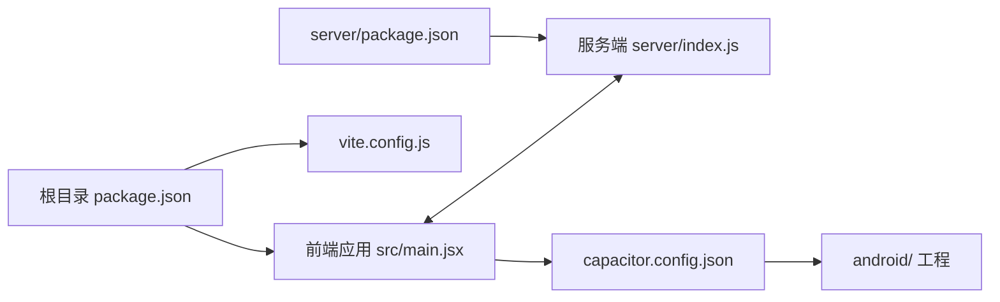
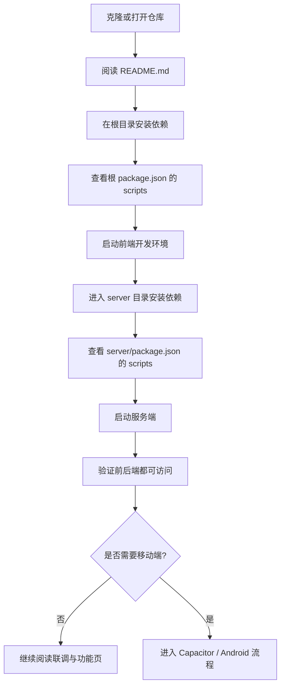

本页只解决一件事：**让第一次接手这个仓库的开发者尽快把项目跑起来，并知道下一步该看哪里**。从仓库结构可以直接确认，这个项目至少包含一个前端应用入口 `src/main.jsx`、一个独立的服务端入口 `server/index.js`、根级 `package.json` 与 `server/package.json` 两套依赖定义，以及 `capacitor.config.json` 和 `android/` 目录对应的移动端打包入口，因此最稳妥的启动路径是：**先看根目录说明，再分别处理前端、服务端，最后再决定是否进入 Android/Capacitor 链路**。Sources: [README.md](README.md#L1-L200), [package.json](package.json#L1-L200), [server/package.json](server/package.json#L1-L200), [src/main.jsx](src/main.jsx#L1-L200), [server/index.js](server/index.js#L1-L320), [capacitor.config.json](capacitor.config.json#L1-L200)

如果你是第一次进入这个项目，建议按这个阅读顺序继续：先完成本页，然后进入 [项目概览](1-xiang-mu-gai-lan) 建立全局认知；如果你要立刻跑前端，就看 [前端开发环境与构建命令](5-qian-duan-kai-fa-huan-jing-yu-gou-jian-ming-ling)；如果你需要接口和后台能力，就接着看 [后端服务启动与端口约定](6-hou-duan-fu-wu-qi-dong-yu-duan-kou-yue-ding) 与 [前后端联调的数据入口](7-qian-hou-duan-lian-diao-de-shu-ju-ru-kou)；如果你的目标是 APK 或平板终端，再继续到 [移动端与 Android 打包入口](8-yi-dong-duan-yu-android-da-bao-ru-kou)。Sources: [README.md](README.md#L1-L200), [package.json](package.json#L1-L200), [server/package.json](server/package.json#L1-L200), [capacitor.config.json](capacitor.config.json#L1-L200)

## 先建立一个最小启动心智模型

对新手来说，最重要的不是一开始理解全部业务，而是知道**这个仓库不是“单体一个命令跑天下”，而是“前端 + 服务端 + 可选移动端”的组合”**。根目录存在 `vite.config.js`、`src/` 和根级 `package.json`，这说明前端开发体验以 Vite 工程为中心；同时 `server/` 目录下又有独立的 `package.json` 和 `index.js`，说明服务端是单独安装、单独启动的一套 Node 运行单元；而 `capacitor.config.json` 与 `android/` 则意味着网页应用还能同步到 Android 工程中。Sources: [vite.config.js](vite.config.js#L1-L200), [package.json](package.json#L1-L200), [src/main.jsx](src/main.jsx#L1-L200), [server/package.json](server/package.json#L1-L200), [server/index.js](server/index.js#L1-L320), [capacitor.config.json](capacitor.config.json#L1-L200)

下面这个 Mermaid 图不是实现细节图，而是**启动顺序图**。你可以把它理解为“先跑谁、谁依赖谁”的操作地图。Sources: [package.json](package.json#L1-L200), [server/package.json](server/package.json#L1-L200), [src/main.jsx](src/main.jsx#L1-L200), [server/index.js](server/index.js#L1-L320), [capacitor.config.json](capacitor.config.json#L1-L200)



## 你会接触到的三个启动单元

为了避免一上来就进错目录，先把三个启动单元区分清楚。前端在根目录，服务端在 `server/`，移动端在 `android/`。这三个目录各自承担不同职责，所以“装依赖”和“启动命令”也应该分开看。Sources: [package.json](package.json#L1-L200), [server/package.json](server/package.json#L1-L200), [capacitor.config.json](capacitor.config.json#L1-L200), [src/main.jsx](src/main.jsx#L1-L200), [server/index.js](server/index.js#L1-L320)

| 启动单元 | 你进入的目录 | 关键文件 | 你现在要做什么 |
|---|---|---|---|
| 前端开发 | 仓库根目录 | `package.json`、`vite.config.js`、`src/main.jsx` | 安装根依赖，查看并执行根脚本 |
| 服务端开发 | `server/` | `server/package.json`、`server/index.js` | 安装服务端依赖，查看并执行服务脚本 |
| Android/移动端 | 仓库根目录 + `android/` | `capacitor.config.json`、`android/` | 在网页可运行后，再同步或打开 Android 工程 |

Sources: [package.json](package.json#L1-L200), [vite.config.js](vite.config.js#L1-L200), [src/main.jsx](src/main.jsx#L1-L200), [server/package.json](server/package.json#L1-L200), [server/index.js](server/index.js#L1-L320), [capacitor.config.json](capacitor.config.json#L1-L200)

## 推荐的最快启动路径

对于初次接手者，最省时间的做法是：**先只验证前端能跑，再验证服务端能跑，最后才碰移动端**。因为 `src/`、`server/` 和 `android/` 在仓库里是并列存在的，说明移动端不是最小闭环的第一步；真正的最小闭环应该是“前端页面 + 服务端接口/数据能力”。Sources: [package.json](package.json#L1-L200), [src/main.jsx](src/main.jsx#L1-L200), [server/package.json](server/package.json#L1-L200), [server/index.js](server/index.js#L1-L320), [capacitor.config.json](capacitor.config.json#L1-L200)



## 第 1 步：先读根目录说明并确认依赖入口

根目录有 `README.md` 与 `package.json`，所以第一步不应该是盲目执行命令，而应该先看 README 的项目说明，再打开根 `package.json` 确认 `scripts`。这是因为不同仓库对开发脚本的命名可能不同，而 `package.json` 才是实际可执行命令的唯一依据。Sources: [README.md](README.md#L1-L200), [package.json](package.json#L1-L200)

对于新手，最安全的操作顺序可以写成这样：先在仓库根目录执行依赖安装，再根据根 `package.json` 中的脚本启动开发环境；如果看到的是 Vite 相关脚本，那么通常就意味着你已经进入了前端开发入口。这里不应跳过“看脚本”这一步，因为仓库同时还存在大量部署、校验、调试脚本，只有 `package.json` 的脚本定义才是正式入口。Sources: [package.json](package.json#L1-L200), [vite.config.js](vite.config.js#L1-L200), [README.md](README.md#L1-L200)

| 动作 | 位置 | 目的 | 你要确认什么 |
|---|---|---|---|
| 阅读说明 | 根目录 | 先建立启动预期 | README 是否说明了环境或命令 |
| 安装依赖 | 根目录 | 准备前端运行环境 | 根 `package.json` 存在且依赖可解析 |
| 查看脚本 | 根目录 | 找到正式开发命令 | `scripts` 中的开发、构建、预览命令 |
| 启动前端 | 根目录 | 验证 UI 是否能跑 | 页面能否正常打开 |

Sources: [README.md](README.md#L1-L200), [package.json](package.json#L1-L200), [vite.config.js](vite.config.js#L1-L200)

## 第 2 步：再进入 server 目录启动后端

仓库中存在独立的 `server/package.json` 与 `server/index.js`，这表明服务端不是根目录脚本里的附属文件，而是一套需要单独安装依赖、单独启动的运行单元。换句话说，**根目录装完依赖，并不等于 server 目录也能直接跑**。Sources: [server/package.json](server/package.json#L1-L200), [server/index.js](server/index.js#L1-L320)

因此第二步的标准动作是：进入 `server/` 目录，单独安装依赖，然后查看 `server/package.json` 的 `scripts`，再按脚本名称启动服务。只有当服务端进程已经运行，你后续查看管理台、抓取数据、联调动态内容时才有意义。Sources: [server/package.json](server/package.json#L1-L200), [server/index.js](server/index.js#L1-L320)

下面这张“前后对照表”适合新手避免把根目录和 `server/` 目录混淆。Sources: [package.json](package.json#L1-L200), [server/package.json](server/package.json#L1-L200)

| 事项 | 错误做法 | 正确做法 |
|---|---|---|
| 安装服务端依赖 | 只在根目录安装一次 | 进入 `server/` 后再安装一次 |
| 找服务端启动命令 | 只看根 `package.json` | 打开 `server/package.json` 看 `scripts` |
| 判断后端是否存在 | 以为只是一些脚本文件 | 看到 `server/index.js` + `server/package.json`，按独立服务理解 |

Sources: [package.json](package.json#L1-L200), [server/package.json](server/package.json#L1-L200), [server/index.js](server/index.js#L1-L320)

## 第 3 步：网页能跑之后，再决定是否进入 Android/Capacitor

`capacitor.config.json` 与 `android/` 目录已经明确告诉我们：这个项目支持把网页应用同步到 Android 工程中。但从“快速启动”的角度，这一步不是最先做的，因为移动端依赖的是前面网页工程已经能正常构建和运行。Sources: [capacitor.config.json](capacitor.config.json#L1-L200), [package.json](package.json#L1-L200), [android/app/build.gradle](android/app/build.gradle#L1-L200)

对新手来说，正确节奏是：**先确认前端页面能打开、服务端能响应，再进入移动端链路**。否则你很容易把网页运行问题误判为 Android 打包问题。等你已经完成网页闭环后，再继续看 [移动端与 Android 打包入口](8-yi-dong-duan-yu-android-da-bao-ru-kou)。Sources: [capacitor.config.json](capacitor.config.json#L1-L200), [android/settings.gradle](android/settings.gradle#L1-L200), [android/app/build.gradle](android/app/build.gradle#L1-L200)

## 一个适合新手的目录识别图

下面这张结构图只保留“快速启动”真正需要关心的目录，目的是帮你在第一次打开仓库时快速分辨哪些地方是主入口，哪些地方暂时可以不看。Sources: [package.json](package.json#L1-L200), [server/package.json](server/package.json#L1-L200), [capacitor.config.json](capacitor.config.json#L1-L200), [src/main.jsx](src/main.jsx#L1-L200), [server/index.js](server/index.js#L1-L320)

```text
E:\CJDLT
├─ README.md                 # 先读
├─ package.json              # 根目录前端脚本入口
├─ vite.config.js            # 前端构建配置
├─ src/                      # 前端源码
│  ├─ main.jsx               # 前端入口
│  ├─ pages/
│  └─ admin/
├─ server/                   # 独立后端
│  ├─ package.json           # 后端脚本入口
│  ├─ index.js               # 后端入口
│  └─ db.json                # 本地数据文件
├─ capacitor.config.json     # 移动端桥接配置
└─ android/                  # Android 原生工程
```

## 快速检查清单

如果你只是想判断“我是不是已经起对了”，可以用下面这张清单做自检。它不要求你理解实现，只要求你确认自己没有走错启动路径。Sources: [README.md](README.md#L1-L200), [package.json](package.json#L1-L200), [server/package.json](server/package.json#L1-L200), [src/main.jsx](src/main.jsx#L1-L200), [server/index.js](server/index.js#L1-L320), [capacitor.config.json](capacitor.config.json#L1-L200)

| 检查项 | 通过标准 | 如果没通过，先看哪里 |
|---|---|---|
| 能找到项目说明 | 已阅读 `README.md` | [项目概览](1-xiang-mu-gai-lan) |
| 能找到前端入口 | 知道根目录和 `src/main.jsx` 是前端入口 | [前端开发环境与构建命令](5-qian-duan-kai-fa-huan-jing-yu-gou-jian-ming-ling) |
| 能找到后端入口 | 知道 `server/package.json` 和 `server/index.js` 是后端入口 | [后端服务启动与端口约定](6-hou-duan-fu-wu-qi-dong-yu-duan-kou-yue-ding) |
| 知道联调不是只跑前端 | 明白还需要单独起 `server/` | [前后端联调的数据入口](7-qian-hou-duan-lian-diao-de-shu-ju-ru-kou) |
| 知道移动端不是第一步 | 明白 `android/` 要放在网页闭环之后 | [移动端与 Android 打包入口](8-yi-dong-duan-yu-android-da-bao-ru-kou) |

Sources: [README.md](README.md#L1-L200), [package.json](package.json#L1-L200), [server/package.json](server/package.json#L1-L200), [server/index.js](server/index.js#L1-L320), [src/main.jsx](src/main.jsx#L1-L200), [capacitor.config.json](capacitor.config.json#L1-L200)

## 新手最容易踩的坑

这个仓库里有大量部署脚本、校验脚本、备份文件、调试文件和历史资产，因此新手最容易犯的错不是“不会写代码”，而是**把辅助文件当成正式启动入口**。真正的一线入口只有少数几个：根 `README.md`、根 `package.json`、`src/main.jsx`、`server/package.json`、`server/index.js`、`capacitor.config.json`。只要先围绕这几个文件行动，你的启动路径通常不会偏。Sources: [README.md](README.md#L1-L200), [package.json](package.json#L1-L200), [src/main.jsx](src/main.jsx#L1-L200), [server/package.json](server/package.json#L1-L200), [server/index.js](server/index.js#L1-L320), [capacitor.config.json](capacitor.config.json#L1-L200)

另一个常见误区是：看到 `android/` 就先去开 Android Studio，或者看到 `server/` 里的大量抓取与测试脚本就直接运行调试文件。对于“快速启动”来说，这都太早了。你应当先建立最小闭环，再去看更细的页面和机制；对应的下一步阅读顺序依然建议是 [前端开发环境与构建命令](5-qian-duan-kai-fa-huan-jing-yu-gou-jian-ming-ling) → [后端服务启动与端口约定](6-hou-duan-fu-wu-qi-dong-yu-duan-kou-yue-ding) → [前后端联调的数据入口](7-qian-hou-duan-lian-diao-de-shu-ju-ru-kou)。Sources: [package.json](package.json#L1-L200), [server/package.json](server/package.json#L1-L200), [capacitor.config.json](capacitor.config.json#L1-L200), [server/index.js](server/index.js#L1-L320)

## 你现在应该做什么

如果你现在就要动手，最推荐的动作只有四个：**1）打开 README；2）在根目录安装依赖并按根脚本启动前端；3）进入 `server/` 安装依赖并按服务脚本启动后端；4）确认网页闭环后，再进入 Android/Capacitor**。完成这四步后，你就具备继续阅读 [多门店路由与页面访问方式](9-duo-men-dian-lu-you-yu-ye-mian-fang-wen-fang-shi)、[后台管理台的主要入口](12-hou-tai-guan-li-tai-de-zhu-yao-ru-kou) 和后续深入解析页面的基础。Sources: [README.md](README.md#L1-L200), [package.json](package.json#L1-L200), [server/package.json](server/package.json#L1-L200), [src/main.jsx](src/main.jsx#L1-L200), [server/index.js](server/index.js#L1-L320), [capacitor.config.json](capacitor.config.json#L1-L200)