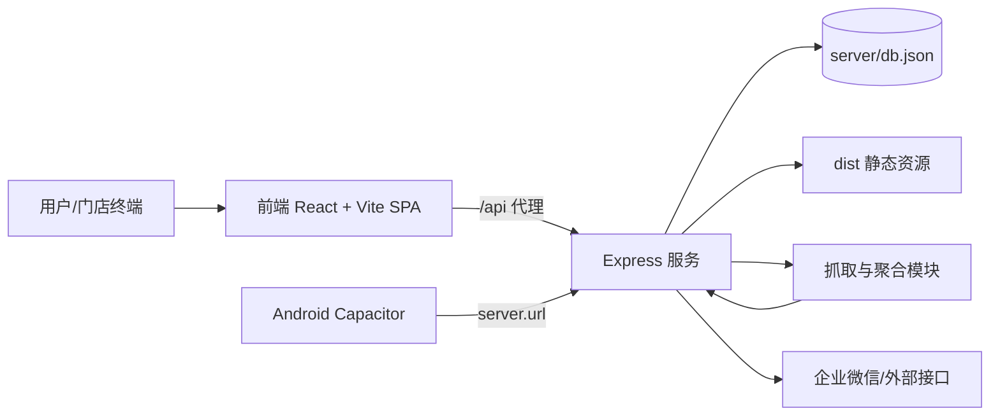

你当前所在页面是 **Get Started / [Overview](1-overview)**（导航中标记为 *[You are currently here]*）。这一页只做一件事：帮初学者先建立“这个仓库到底是什么、由哪些核心部分组成、我接下来该先看哪里”的整体认知，不展开到具体实现细节。  
Sources: [src/App.jsx](src/App.jsx#L33-L77), [prd_current.md](prd_current.md#L13-L21)

这个项目是一个面向体彩门店场景的系统：前台是 React + Vite 单页应用（HashRouter），后端是 Node/Express，另外还有数据抓取与定时更新能力；目标是把“门店展示 + 互动玩法 + 后台管理”放到同一套工程里。  
Sources: [src/App.jsx](src/App.jsx#L35-L76), [server/index.js](server/index.js#L133-L143), [prd_current.md](prd_current.md#L4-L21)

## 一眼看懂系统（架构总览）

先看总图：前端通过 `/api` 代理访问后端，后端同时负责静态资源托管、API、数据文件与部分抓取能力；移动端通过 Capacitor 指向已部署服务地址。  
Sources: [vite.config.js](vite.config.js#L26-L34), [server/index.js](server/index.js#L144-L163), [capacitor.config.json](capacitor.config.json#L1-L9)



这个图对新手最重要的意义是：**你不是在维护三个独立项目，而是在维护一个“前端入口 + 后端编排 + 数据更新链路”的组合体**。  
Sources: [src/main.jsx](src/main.jsx#L40-L46), [server/index.js](server/index.js#L136-L151), [server/index.js](server/index.js#L15-L18)

## 项目能力边界（Overview 级别）

下面这张表只回答“这个仓库能做什么”，不回答“怎么做”。  
Sources: [src/App.jsx](src/App.jsx#L41-L75), [prd_current.md](prd_current.md#L22-L45)

| 能力域 | 你会看到什么 | 代码入口（示例） |
|---|---|---|
| 门店前台 | 多门店路由、不同风格页面、购彩互动入口 | `src/App.jsx`、`src/pages/*` |
| 后台管理 | 概览、内容管理、喜报、信源监控等菜单 | `src/admin/AdminLayout.jsx` |
| 服务端 API | 数据读取、心跳上报、静态托管、无缓存策略 | `server/index.js` |
| 数据更新 | 定时拉取数据并提交 `public/data.json` | `.github/workflows/fetch-lottery.yml` |
| 移动封装 | Capacitor Android 配置，`dist` 作为 web 资源目录 | `capacitor.config.json`、`android/` |

Sources: [src/admin/AdminLayout.jsx](src/admin/AdminLayout.jsx#L15-L30), [server/index.js](server/index.js#L145-L171), [.github/workflows/fetch-lottery.yml](.github/workflows/fetch-lottery.yml#L1-L33), [capacitor.config.json](capacitor.config.json#L1-L9)

## 关键目录速览（面向初学者）

你可以先把仓库想成下面 6 个“工作区块”。  
Sources: [src/App.jsx](src/App.jsx#L1-L27), [server/package.json](server/package.json#L1-L9)

```text
CJDLT/
├─ src/                # 前端应用（页面、路由、后台界面）
├─ server/             # Express 服务与抓取/聚合逻辑
├─ public/             # 前端静态资源与 data.json
├─ android/            # Capacitor Android 工程
├─ .github/workflows/  # 自动化任务（定时抓取）
└─ package.json        # 前端开发/构建脚本
```

如果你是第一次接触该项目，建议先只在 `src/`、`server/`、`package.json` 三处活动，其它目录先“知道存在即可”。  
Sources: [package.json](package.json#L6-L11), [src/main.jsx](src/main.jsx#L1-L6), [server/package.json](server/package.json#L6-L9)

## 运行形态（你会如何启动它）

前端工程通过 `vite` 提供 `dev/build/preview`，后端工程通过 `node index.js` 启动；本地开发时，Vite 把 `/api` 转发到 `127.0.0.1:3366`。  
Sources: [package.json](package.json#L6-L11), [server/package.json](server/package.json#L6-L9), [vite.config.js](vite.config.js#L26-L33)

| 形态 | 主要命令/配置 | 作用 |
|---|---|---|
| 前端本地开发 | `npm run dev` | 本地调试页面与路由 |
| 前端构建 | `npm run build` | 生成 `dist` 供服务端托管 |
| 后端运行 | `node server/index.js`（见 server scripts） | 提供 API 与静态文件服务 |
| Android 模式 | `capacitor.config.json` 的 `server.url` | 移动端直连部署服务 |

Sources: [package.json](package.json#L6-L11), [server/package.json](server/package.json#L6-L9), [capacitor.config.json](capacitor.config.json#L5-L8)

## 建议阅读顺序（从 Overview 出发）

你当前就在第一步：[Overview](1-overview)。下一步建议按“先跑起来，再看结构，再看路由”的顺序阅读，这样最不容易迷路。  
Sources: [package.json](package.json#L6-L11), [src/App.jsx](src/App.jsx#L35-L75)

1. [Quick Start](2-quick-start)  
2. [项目结构速览：前端展示端、后台管理端与抓取服务的协作关系](3-xiang-mu-jie-gou-su-lan-qian-duan-zhan-shi-duan-hou-tai-guan-li-duan-yu-zhua-qu-fu-wu-de-xie-zuo-guan-xi)  
3. [本地开发工作流：Vite 前端调试、Node 服务启动与联调方式](4-ben-di-kai-fa-gong-zuo-liu-vite-qian-duan-diao-shi-node-fu-wu-qi-dong-yu-lian-diao-fang-shi)  
4. [核心访问路径：门店前台、统一后台与多门店路由约定](5-he-xin-fang-wen-lu-jing-men-dian-qian-tai-tong-hou-tai-yu-duo-men-dian-lu-you-yue-ding)  

Sources: [src/App.jsx](src/App.jsx#L38-L75), [vite.config.js](vite.config.js#L26-L34)

## 你现在应该记住的 3 件事

第一，项目主干是 **React 前端 + Express 后端**，并且前后端在同一仓库协作。  
Sources: [src/main.jsx](src/main.jsx#L40-L46), [server/index.js](server/index.js#L133-L143)

第二，路由层面已经有 **统一后台** 和 **多门店前台/后台** 的骨架，后续页面学习都围绕这个骨架展开。  
Sources: [src/App.jsx](src/App.jsx#L41-L75), [src/admin/AdminLayout.jsx](src/admin/AdminLayout.jsx#L11-L19)

第三，项目有 **持续数据更新与移动端运行** 两条扩展线，但在 Overview 阶段你只需知道它们存在，不必深入实现。