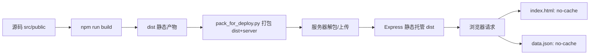
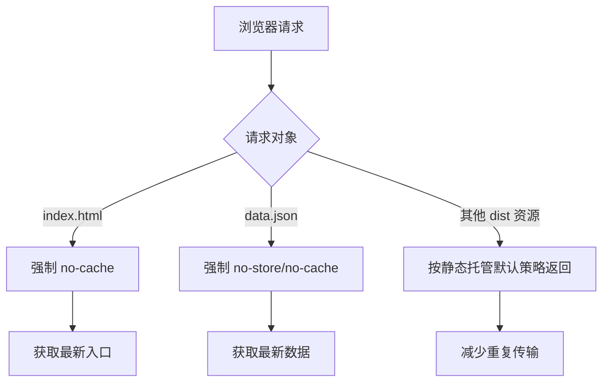

你当前位于 [构建与发布基础：静态资源构建、服务端静态托管与缓存策略认知](10-gou-jian-yu-fa-bu-ji-chu-jing-tai-zi-yuan-gou-jian-fu-wu-duan-jing-tai-tuo-guan-yu-huan-cun-ce-lue-ren-zhi)。本页只回答三个基础问题：**前端如何构建出可发布静态资源**、**这些资源如何被服务端托管**、**为什么这个项目要对 `index.html` 与 `data.json` 采用强制不缓存策略**。Sources: [package.json](package.json#L6-L10), [server/index.js](server/index.js#L145-L163)

---

## 1) 架构假设与验证结论（先看全景）

从代码可验证的发布路径是：本地执行 `vite build` 生成 `dist`，Node 服务通过 `express.static` 托管 `dist`，同时对 `index.html` 和 `data.json` 追加 no-cache 头，保证每次发布后客户端能尽快拿到新入口与新数据。Sources: [package.json](package.json#L6-L10), [server/index.js](server/index.js#L145-L163), [server/index.js](server/index.js#L2939-L2947)



上图中的每个节点都能在仓库中找到直接证据：构建命令、打包脚本、服务端静态路径与缓存头设置均已落地。Sources: [pack_for_deploy.py](pack_for_deploy.py#L7-L27), [deploy.py](deploy.py#L37-L42), [server/index.js](server/index.js#L145-L163)

---

## 2) 构建层：Vite 的“产物可发布性”配置

项目的标准构建入口是 `npm run build -> vite build`，这是发布产物生成的唯一显式脚本入口。Sources: [package.json](package.json#L6-L10)

Vite 配置中启用了 `@vitejs/plugin-legacy`，并明确指定了较低版本浏览器目标（如 Android 7 / Chrome 61），同时 `build.cssTarget = 'chrome61'`，这表明构建阶段已经考虑“旧设备可运行”而不只是现代浏览器最佳体验。Sources: [vite.config.js](vite.config.js#L7-L25)

此外，`server.proxy['/api']` 仅用于本地开发转发到 `127.0.0.1:3366`，它属于开发联调能力，不参与生产发布托管链路。Sources: [vite.config.js](vite.config.js#L26-L33)

---

## 3) 托管层：静态资源由谁提供（两种模式并存）

当前仓库存在两种可验证托管模式：**模式 A：Node(Express) 直接托管 `dist`**；**模式 B：Nginx 托管前端并反代 `/api`**。Sources: [server/index.js](server/index.js#L155-L163), [deploy/nginx.conf](deploy/nginx.conf#L6-L20)

| 维度 | 模式 A：Express 直出 | 模式 B：Nginx + Node API |
|---|---|---|
| 前端静态文件 | `express.static('../dist')` | `root /var/www/cj_lottery/dist; try_files ... /index.html` |
| SPA 回退 | `app.get(/^(?!\/api).+/)` 返回 `dist/index.html` | `try_files` 回退到 `/index.html` |
| API 路由 | 同一 Node 服务内 `/api/...` | `/api` 反代到 `localhost:3000` |
| 适用脚本迹象 | `deploy.py` / `deploy_full.py` 直接拉起 `server/index.js` | `deploy/nginx.conf` + `deploy/setup.sh` 安装 nginx |

Sources: [server/index.js](server/index.js#L2939-L2950), [deploy/nginx.conf](deploy/nginx.conf#L6-L20), [deploy/setup.sh](deploy/setup.sh#L14-L29), [deploy.py](deploy.py#L122-L129), [deploy_full.py](deploy_full.py#L57-L59)

---

## 4) 缓存策略：为什么要“只让入口和数据强制不缓存”

服务端对 `data.json` 单独路由并设置 `Cache-Control: private, no-cache, no-store, must-revalidate`，且直接返回 `../dist/data.json`，这是明确的“数据实时优先”策略。Sources: [server/index.js](server/index.js#L145-L151)

`express.static` 中仅对 `index.html` 设置 no-cache，并在非 `/api` 的 SPA 回退路由再次设置 no-cache，这形成“双保险”：无论是静态命中还是路由回退，入口文档都不会被浏览器长时间缓存。Sources: [server/index.js](server/index.js#L155-L163), [server/index.js](server/index.js#L2939-L2947)

项目还存在 `add_cache_bust.py`，会直接改写远端 `index.html` 中的 JS/CSS 引用，追加 `?v=timestamp`；这是一种“运维侧人工 cache bust”补救手段，说明团队在历史发布中确实遇到过缓存更新不及时问题。Sources: [add_cache_bust.py](add_cache_bust.py#L24-L57)



这个策略的核心认知是：**入口与关键动态数据必须“新鲜”，其他静态资源由常规静态服务承接性能收益**。Sources: [server/index.js](server/index.js#L145-L163)

---

## 5) 发布产物与打包边界（你实际会上传什么）

`pack_for_deploy.py` 会打包 `dist/` 与 `server/`，并明确跳过 `server/node_modules` 与 `server/db.json`；前者避免无谓体积，后者避免发布覆盖线上数据库。Sources: [pack_for_deploy.py](pack_for_deploy.py#L7-L20)

`deploy.py` 的流程是“本地构建 -> 打包 -> 上传 -> 解压 -> 安装依赖 -> PM2 重启/拉起”；这是最完整的发布闭环脚本。Sources: [deploy.py](deploy.py#L37-L42), [deploy.py](deploy.py#L100-L133)

`deploy_full.py` 与 `deploy_remote.py` 展示了另一类流程：直接清空重传或按目录上传后 PM2 启动，这些脚本共同证明本项目发布并非单一流水线，而是“多脚本并行演进”的状态。Sources: [deploy_full.py](deploy_full.py#L41-L59), [deploy_remote.py](deploy_remote.py#L52-L63)

---

## 6) 与本页相关的最小项目结构（发布视角）

从“构建与发布”角度，最关键目录与文件如下。Sources: [package.json](package.json#L6-L10), [vite.config.js](vite.config.js#L6-L35), [server/index.js](server/index.js#L145-L163)

```text
.
├─ package.json              # npm run build / dev / preview
├─ vite.config.js            # legacy + cssTarget + dev proxy
├─ dist/                     # 构建产物（由 vite build 生成）
├─ server/
│  ├─ index.js               # 静态托管 + API + 缓存头策略
│  └─ package.json           # 服务端启动依赖
├─ deploy/
│  ├─ nginx.conf             # Nginx 静态+反代方案
│  └─ setup.sh               # 服务器基础环境初始化
├─ pack_for_deploy.py        # 产物打包边界
└─ deploy.py                 # 端到端发布脚本
```

---

## 7) 常见配置项速查（构建/托管/缓存）

| 配置位置 | 配置项 | 当前值/行为 | 作用 |
|---|---|---|---|
| `package.json` | `scripts.build` | `vite build` | 生成可部署前端产物 |
| `vite.config.js` | `legacy.targets` | Chrome61/Android7 等 | 旧端兼容 |
| `vite.config.js` | `build.cssTarget` | `chrome61` | 保守 CSS 输出 |
| `server/index.js` | `express.static('../dist')` | 启用 | 托管前端静态资源 |
| `server/index.js` | `/data.json` 头 | no-store/no-cache | 数据实时性 |
| `server/index.js` | `index.html` 头 | no-cache/no-store | 发布后入口刷新 |
| `deploy/nginx.conf` | `try_files ... /index.html` | 启用 | SPA 刷新防 404 |
| `deploy/nginx.conf` | `/api` 反代 | `localhost:3000` | 前后端分层托管 |

Sources: [package.json](package.json#L6-L10), [vite.config.js](vite.config.js#L7-L33), [server/index.js](server/index.js#L145-L163), [deploy/nginx.conf](deploy/nginx.conf#L6-L20)

---

## 8) 建议阅读顺序（从“会发版”到“理解架构深层机制”）

读完本页后，建议先看 [Android/Capacitor 打包入口与移动端运行模式说明](11-android-capacitor-da-bao-ru-kou-yu-yi-dong-duan-yun-xing-mo-shi-shuo-ming)（同属部署准备），再进入 [服务端入口职责：静态托管、API 编排、文件处理与异常兜底](24-fu-wu-duan-ru-kou-zhi-ze-jing-tai-tuo-guan-api-bian-pai-wen-jian-chu-li-yu-yi-chang-dou-di) 和 [缓存与实时性设计：data.json 特殊处理与前端刷新一致性](29-huan-cun-yu-shi-shi-xing-she-ji-data-json-te-shu-chu-li-yu-qian-duan-shua-xin-zhi-xing) 做机制深挖，最后用 [发布与远程诊断流程：部署脚本、服务检查与故障定位套路](31-fa-bu-yu-yuan-cheng-zhen-duan-liu-cheng-bu-shu-jiao-ben-fu-wu-jian-cha-yu-gu-zhang-ding-wei-tao-lu) 补齐运维闭环。Sources: [deploy.py](deploy.py#L37-L133), [server/index.js](server/index.js#L145-L163), [server/index.js](server/index.js#L2939-L2950)