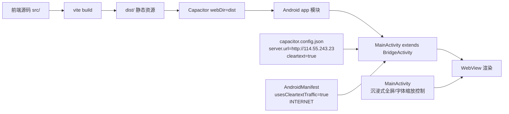

本页位于「部署与运行准备」阶段，目标是帮你快速定位这个仓库里 **Android 打包入口** 在哪里、**Capacitor 与 Android 工程如何衔接**、以及当前配置下可见的 **移动端运行模式**（本地资源模式与远端地址模式）。内容仅覆盖打包入口与运行模式，不展开后台业务或抓取链路。  
Sources: [package.json](package.json#L6-L15), [capacitor.config.json](capacitor.config.json#L1-L9), [android/settings.gradle](android/settings.gradle#L1-L5)

## 你现在的位置与建议阅读顺序

你当前页是 [Android/Capacitor 打包入口与移动端运行模式说明](11-android-capacitor-da-bao-ru-kou-yu-yi-dong-duan-yun-xing-mo-shi-shuo-ming)。建议先读 [构建与发布基础：静态资源构建、服务端静态托管与缓存策略认知](10-gou-jian-yu-fa-bu-ji-chu-jing-tai-zi-yuan-gou-jian-fu-wu-duan-jing-tai-tuo-guan-yu-huan-cun-ce-lue-ren-zhi) 建立 Web 构建认知，再进入本页看移动容器；读完本页后进入 [系统全景架构：React 多页面前台 + Express API + 抓取任务层](13-xi-tong-quan-jing-jia-gou-react-duo-ye-mian-qian-tai-express-api-zhua-qu-ren-wu-ceng) 看整体架构中的移动端定位。  
Sources: [package.json](package.json#L6-L11), [android/settings.gradle](android/settings.gradle#L1-L5)

## 打包入口一览（先看入口，再看细节）

从仓库可验证的入口看，Web 侧构建入口在 `package.json` 的 `build`（`vite build`），Capacitor CLI 已作为依赖安装，Android 原生侧入口为 `android/gradlew.bat` 与 `android/app` Gradle 模块。也就是说，这个项目的移动打包是典型的「**Web 构建产物 + Capacitor 容器 + Android Gradle**」三段式。  
Sources: [package.json](package.json#L6-L15), [android/build.gradle](android/build.gradle#L1-L12), [android/settings.gradle](android/settings.gradle#L1-L5)

| 入口类型 | 入口位置 | 在链路中的作用 |
|---|---|---|
| Web 构建入口 | `package.json` → `build: vite build` | 生成 Web 静态资源（对应 `webDir: dist`） |
| Capacitor 配置入口 | `capacitor.config.json` | 声明 `appId/appName/webDir/server` |
| Android 工程入口 | `android/settings.gradle` + `android/app/build.gradle` | 组装 app 模块与 Capacitor 依赖并输出 APK/AAB |
| Android 执行入口 | `android/gradlew.bat` | 在 Windows 下执行 Gradle 构建任务 |

Sources: [package.json](package.json#L6-L11), [capacitor.config.json](capacitor.config.json#L1-L9), [android/settings.gradle](android/settings.gradle#L1-L5), [android/app/build.gradle](android/app/build.gradle#L1-L46)

## 架构关系图（Android 打包与运行视角）

先看图：它只描述本页关心的打包与运行链路，不涉及业务页面实现细节。  
Sources: [package.json](package.json#L6-L15), [capacitor.config.json](capacitor.config.json#L1-L9), [android/app/src/main/java/com/cj/lottery/MainActivity.java](android/app/src/main/java/com/cj/lottery/MainActivity.java#L9-L79)



## 当前可见的两种移动端运行模式

从配置文件字面可以明确看到两组运行参数并存：`webDir: "dist"`（本地静态资源目录）与 `server.url: "http://114.55.243.23"`（远端地址），同时 `cleartext` 与 `usesCleartextTraffic` 都开启，且声明了 `INTERNET` 权限。因此，本项目在配置层面具备 **本地资源驱动** 与 **远端地址驱动** 两种运行形态。  
Sources: [capacitor.config.json](capacitor.config.json#L4-L8), [android/app/src/main/AndroidManifest.xml](android/app/src/main/AndroidManifest.xml#L11-L43), [package.json](package.json#L8-L11)

| 运行模式 | 关键配置证据 | 典型用途（按配置语义） | 网络要求 |
|---|---|---|---|
| 本地资源模式 | `webDir: "dist"` + `build: vite build` | 使用构建后的本地静态资源 | 可离线访问静态内容（不代表业务 API 离线） |
| 远端地址模式 | `server.url: "http://114.55.243.23"` | 容器加载远端地址 | 依赖网络可达性 |
| HTTP 明文放行 | `cleartext: true` + `usesCleartextTraffic=true` | 允许 HTTP（非 HTTPS）访问 | 需关注生产网络安全策略 |

Sources: [capacitor.config.json](capacitor.config.json#L5-L8), [package.json](package.json#L8-L11), [android/app/src/main/AndroidManifest.xml](android/app/src/main/AndroidManifest.xml#L11-L43)

## Android 容器运行特征（与“移动端观感”直接相关）

`MainActivity` 继承 `BridgeActivity`，并在生命周期中执行字体缩放与缩放手势控制：`fontScale=1.0f`、`setTextZoom(100)`、禁用缩放控件。这说明项目对「不同设备字体缩放导致布局漂移」进行了原生层强制收敛。  
Sources: [android/app/src/main/java/com/cj/lottery/MainActivity.java](android/app/src/main/java/com/cj/lottery/MainActivity.java#L9-L39)

同一文件还实现了沉浸式全屏与刘海区域适配（`LAYOUT_IN_DISPLAY_CUTOUT_MODE_SHORT_EDGES` + `IMMERSIVE_STICKY`），Manifest 中 Activity 设为 `fullSensor` 与 `singleTask`。这组配置共同指向「全屏展示类终端」的运行取向。  
Sources: [android/app/src/main/java/com/cj/lottery/MainActivity.java](android/app/src/main/java/com/cj/lottery/MainActivity.java#L40-L79), [android/app/src/main/AndroidManifest.xml](android/app/src/main/AndroidManifest.xml#L13-L21)

## Android 工程与 Capacitor 绑定点

`android/settings.gradle` 同时引入 `:app`、`:capacitor-cordova-android-plugins`，并 `apply from: capacitor.settings.gradle`；而 `capacitor.settings.gradle` 明确把 `:capacitor-android` 指向 `node_modules/@capacitor/android/capacitor`。这说明 Android 工程对 Capacitor 核心模块的依赖是显式、可追踪的。  
Sources: [android/settings.gradle](android/settings.gradle#L1-L5), [android/capacitor.settings.gradle](android/capacitor.settings.gradle#L1-L4)

`android/app/build.gradle` 中 `implementation project(':capacitor-android')` 与 `implementation project(':capacitor-cordova-android-plugins')` 是真正的链接点；`capacitor.build.gradle` 还把 Java 编译目标设到 21。配合 `variables.gradle`（minSdk 24 / targetSdk 36），可得到当前 Android 构建基线。  
Sources: [android/app/build.gradle](android/app/build.gradle#L33-L46), [android/app/capacitor.build.gradle](android/app/capacitor.build.gradle#L3-L10), [android/variables.gradle](android/variables.gradle#L1-L16)

## 项目结构（本页相关最小视图）

下面是只保留打包与运行模式分析所需的目录切片，方便快速定位文件。  
Sources: [android/settings.gradle](android/settings.gradle#L1-L5), [android/app/src/main/AndroidManifest.xml](android/app/src/main/AndroidManifest.xml#L1-L44), [capacitor.config.json](capacitor.config.json#L1-L9)

```text
.
├─ package.json
├─ capacitor.config.json
└─ android/
   ├─ settings.gradle
   ├─ build.gradle
   ├─ variables.gradle
   ├─ gradlew.bat
   └─ app/
      ├─ build.gradle
      ├─ capacitor.build.gradle
      └─ src/main/
         ├─ AndroidManifest.xml
         └─ java/com/cj/lottery/MainActivity.java
```

## 上手检查清单（打包前先过一遍）

如果你要继续到实际发布动作，建议按这个顺序做最小核对：先确认 Web 构建入口与 `webDir` 一致，再确认 `server.url`/明文策略是否符合目标环境，最后确认 Android SDK/Java 基线与构建机一致。  
Sources: [package.json](package.json#L6-L11), [capacitor.config.json](capacitor.config.json#L4-L8), [android/variables.gradle](android/variables.gradle#L1-L16), [android/app/capacitor.build.gradle](android/app/capacitor.build.gradle#L3-L7)

| 检查项 | 文件 | 当前值 |
|---|---|---|
| Web 构建命令 | `package.json` | `vite build` |
| Web 资源目录 | `capacitor.config.json` | `dist` |
| 远端地址 | `capacitor.config.json` | `http://114.55.243.23` |
| HTTP 明文 | Capacitor + Manifest | 均开启 |
| 最低/目标 SDK | `android/variables.gradle` | 24 / 36 |
| Java 编译级别 | `android/app/capacitor.build.gradle` | 21 |

Sources: [package.json](package.json#L8-L11), [capacitor.config.json](capacitor.config.json#L4-L8), [android/app/src/main/AndroidManifest.xml](android/app/src/main/AndroidManifest.xml#L11-L43), [android/variables.gradle](android/variables.gradle#L1-L4), [android/app/capacitor.build.gradle](android/app/capacitor.build.gradle#L3-L7)

## 下一步阅读

若你希望把本页内容接到完整发布链路，请继续看 [构建与发布基础：静态资源构建、服务端静态托管与缓存策略认知](10-gou-jian-yu-fa-bu-ji-chu-jing-tai-zi-yuan-gou-jian-fu-wu-duan-jing-tai-tuo-guan-yu-huan-cun-ce-lue-ren-zhi)；若要理解移动端在全系统中的架构位置，跳转 [系统全景架构：React 多页面前台 + Express API + 抓取任务层](13-xi-tong-quan-jing-jia-gou-react-duo-ye-mian-qian-tai-express-api-zhua-qu-ren-wu-ceng)。