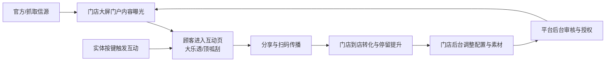

本页聚焦一个核心问题：**这个系统为什么存在，以及它为谁创造了什么价值**。从已实现文档与代码可验证的信息看，项目被定义为面向实体体彩门店的多租户 SaaS，采用“内容运营门户 + 互动小游戏 + 门店后台 + 平台总控”的一体化模式，目标是同时提升门店现场吸引力、互动参与度与平台化管理效率。  
Sources: [prd_cn.md](prd_cn.md#L5-L23), [prd_current.md](prd_current.md#L4-L20), [docs/product_progress_customer.md](docs/product_progress_customer.md#L13-L21)

## 1. 一句话业务定位（Attention）

这不是单点活动页，也不是纯后台系统，而是一个围绕门店经营场景构建的**“展示-互动-运营”闭环产品**：前台负责持续吸引顾客驻留和参与，后台负责内容治理、门店授权与运营控制，最终服务于“到店转化与留存提升”的业务目标。  
Sources: [prd_cn.md](prd_cn.md#L5-L9), [docs/product_progress_customer.md](docs/product_progress_customer.md#L14-L16), [prd_current.md](prd_current.md#L4-L6)

## 2. 价值对象与诉求映射（Interest）

从角色划分看，系统服务四类对象：购彩用户（看内容、玩互动）、门店店长（配内容、配玩法、看门店表现）、平台管理员（管门店生命周期与内容审核）、硬件运营方（实体按键触发体验）。这意味着产品价值不是“单端最优”，而是**多角色协同效率**与**统一内容治理**。  
Sources: [prd_cn.md](prd_cn.md#L10-L14), [prd_current.md](prd_current.md#L7-L12)

| 角色 | 核心诉求 | 系统提供的业务价值 |
|---|---|---|
| 购彩用户 | 到店后有可看、可玩、可分享内容 | 门店门户 + 大乐透 + 顶呱刮形成连续互动路径 |
| 门店店长 | 低门槛更新内容并可控展示 | 门店后台配置、素材提交流程、审核状态回显 |
| 平台管理员 | 批量管门店与合规运营 | SuperAdmin 门店授权、内容发布、审核与信源监控 |
| 硬件运营方 | 线下设备可触发关键互动 | 实体按键映射机选/抽票动作，增强现场参与感 |

Sources: [prd_cn.md](prd_cn.md#L25-L77), [docs/product_progress_customer.md](docs/product_progress_customer.md#L57-L77), [docs/product_progress_customer.md](docs/product_progress_customer.md#L98-L106)

## 3. “一体化”不是口号：业务闭环结构（Interest）

先理解图：下面这张图表达的是**业务流而非技术调用图**，它回答“顾客行为如何被运营体系承接并转化为可管理资产”。  

该闭环有两个关键点：第一，前台的内容展示与互动玩法被后台配置、审核、授权机制持续驱动；第二，信源抓取与兜底机制保证前台“有内容可播”，避免大屏运营中断。  
Sources: [prd_cn.md](prd_cn.md#L25-L72), [docs/product_progress_customer.md](docs/product_progress_customer.md#L23-L33), [docs/product_progress_customer.md](docs/product_progress_customer.md#L79-L87)

## 4. 业务价值主张拆解（Desire）

系统将价值分成三层：**门店现场价值**（屏幕有内容、顾客可互动）、**运营治理价值**（内容可审核、门店可授权、配置可回收）、**稳定交付价值**（信源失败时有兜底、数据可手动刷新、定时任务自动维护）。这三层组合后，业务上能同时覆盖“增长、管控、稳定性”三种诉求。  
Sources: [prd_cn.md](prd_cn.md#L25-L36), [prd_cn.md](prd_cn.md#L58-L72), [server/index.js](server/index.js#L2792-L2901), [server/index.js](server/index.js#L2748-L2771)

从实现侧也能看到这种定位：路由层明确区分门店前台、互动页面与管理入口；服务端提供统一信源接口与刷新接口；监控页直接消费 `/api/system/sources` 与 `/api/system/sources/refresh`，体现“展示端依赖运营数据、运营端反向驱动展示端”的产品结构。  
Sources: [src/App.jsx](src/App.jsx#L53-L71), [server/index.js](server/index.js#L2792-L2901), [src/admin/CrawlerMonitor.jsx](src/admin/CrawlerMonitor.jsx#L38-L50), [src/admin/CrawlerMonitor.jsx](src/admin/CrawlerMonitor.jsx#L163-L180)

## 5. 可量化业务结果（Desire）

项目文档已明确统计口径：门店侧关注访问、机选/套餐操作、分享导流；平台侧关注授权门店规模、到期分布、模块活跃趋势与抓取成功率。也就是说，产品价值并非停留在“页面好看”，而是沉淀为可追踪的经营指标。  
Sources: [prd_cn.md](prd_cn.md#L84-L87), [prd_current.md](prd_current.md#L46-L49), [docs/product_progress_customer.md](docs/product_progress_customer.md#L107-L110)

| 价值维度 | 主要指标 | 业务意义 |
|---|---|---|
| 门店转化 | 访问量、互动次数、分享次数 | 评估现场吸引与传播效果 |
| 运营效率 | 授权状态、有效期、审核流 | 降低多门店管理成本 |
| 数据稳定性 | 抓取成功/降级状态 | 保证大屏内容连续可用 |

Sources: [prd_cn.md](prd_cn.md#L84-L94), [docs/product_progress_customer.md](docs/product_progress_customer.md#L107-L110), [docs/product_progress_customer.md](docs/product_progress_customer.md#L129-L135)

## 6. 当前价值边界与阶段性约束（Action）

本阶段“价值已兑现”集中在：门店门户、大乐透互动、顶呱刮互动、门店后台与平台总控链路，以及抓取兜底能力；“价值待释放”集中在：后台结构重构、数据结构迁移、可选模块降级验证，以及足球/篮球模块仍处进行中。理解这些边界有助于在评审或验收时避免把未来规划误判为当前承诺。  
Sources: [prd_cn.md](prd_cn.md#L96-L100), [docs/product_progress_customer.md](docs/product_progress_customer.md#L65-L67), [docs/product_progress_customer.md](docs/product_progress_customer.md#L88-L97), [prd_current.md](prd_current.md#L63-L67)

## 7. 本页结论与建议阅读

结论：该系统的价值定位可以概括为——**以门店大屏互动为前台抓手，以平台化运营与信源治理为后台支撑，形成可持续迭代的体彩门店数字化运营底座**。如果你要继续深入实现层，建议下一步阅读 [系统全景架构：React 多页面前台 + Express API + 抓取任务层](13-xi-tong-quan-jing-jia-gou-react-duo-ye-mian-qian-tai-express-api-zhua-qu-ren-wu-ceng)，再进入 [路由体系设计：HashRouter 下的主站后台与多租户门店路由](14-lu-you-ti-xi-she-ji-hashrouter-xia-de-zhu-zhan-hou-tai-yu-duo-zu-hu-men-dian-lu-you)。