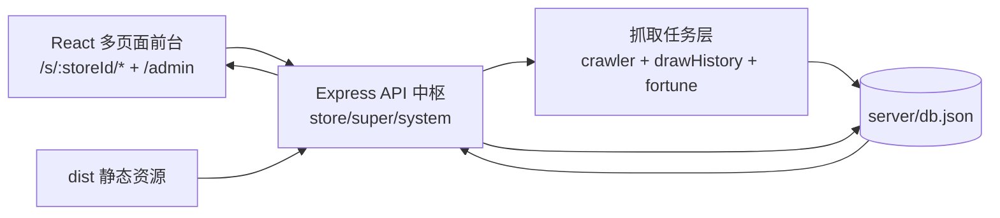
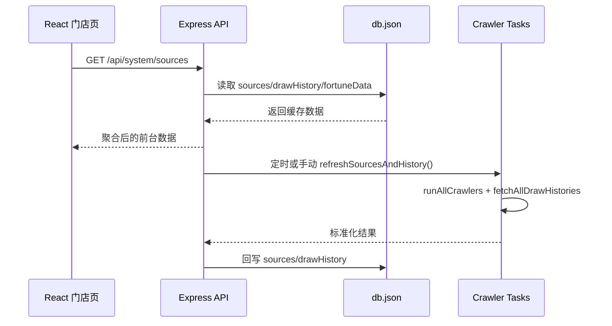

这页的目标是建立**全局心智模型**：这个项目不是“单体前端”或“纯后端服务”，而是由 React 多页面前台、Express API 中枢、以及独立抓取任务能力共同构成，三层围绕同一份 JSON 数据状态协作。Sources: [App.jsx](src/App.jsx#L33-L77), [index.js](server/index.js#L133-L143), [crawler.js](server/crawler.js#L149-L218)

---

## 1. 一眼看懂：三层协作架构（全景图）

在运行形态上，前台页面通过路由进入门店/后台视图；中间层 Express 提供配置、监控、运营、抓取触发等 API，并负责静态资源托管；底层抓取模块拉取开奖、公益金、运势等外部数据并回写数据库文件，形成“展示—编排—采集”的闭环。Sources: [App.jsx](src/App.jsx#L38-L75), [index.js](server/index.js#L2792-L2902), [drawHistory.js](server/drawHistory.js#L105-L134)



该图对应的是代码中可验证的真实边界：`src/App.jsx` 定义页面入口分流，`server/index.js` 作为统一 API 入口与静态托管入口，`server/crawler*.js` 和 `drawHistory.js` 负责外部数据抓取与归一化。Sources: [App.jsx](src/App.jsx#L2-L27), [index.js](server/index.js#L153-L171), [crawlerFortune.js](server/crawlerFortune.js#L128-L156)

---

## 2. 前台层：React 多页面 + 多租户路由容器

前台不是单一路由，而是由 `HashRouter` 下两大路由域组成：`/admin`（统一后台）与 `/s/:storeId`（门店租户页）。门店域内继续挂载首页、计算器、刮刮乐和多套 Portal 风格页面，说明“同一业务能力 + 多视觉模板”是前端组织主线。Sources: [App.jsx](src/App.jsx#L35-L75)

应用挂载层使用 `StrictMode + ErrorBoundary`，并在顶层捕获渲染错误，这意味着全站视图异常会被拦截到统一错误容器，而不是静默失败。Sources: [main.jsx](src/main.jsx#L7-L47)

门店客户端通过 `StoreClientLayout` 每 10 秒上报心跳到 `/api/store/:id/heartbeat`，并可接收后台下发的跳转命令与公告数据；这让前台具备“被运营端远程驱动”的在线状态通道。Sources: [StoreClientLayout.jsx](src/components/StoreClientLayout.jsx#L15-L53), [index.js](server/index.js#L883-L918)

---

## 3. API 层：Express 既是网关也是运行中枢

Express 中枢同时承担中间件、静态托管与 API 编排：启用 `cors`、`compression`、大体积 JSON 解析；托管 `dist`；并对 `index.html`、`data.json` 做显式 no-cache 控制，确保前台页面与开奖数据更新可即时感知。Sources: [index.js](server/index.js#L139-L163), [index.js](server/index.js#L145-L151)

服务端的持久化模型是文件型 JSON：通过 `getDB/saveDB/initDB` 读写 `server/db.json`，并在启动期执行结构检查/迁移逻辑（如 superConfig、scratchLibrary、模板默认值注入），这构成了 API 层和任务层共享状态的基础。Sources: [index.js](server/index.js#L136-L137), [index.js](server/index.js#L173-L200), [index.js](server/index.js#L394-L400)

| API 域 | 路径前缀 | 典型能力 | 主要调用方 |
|---|---|---|---|
| 门店域 | `/api/store/*` | 登录、配置更新、票单/统计、心跳 | 门店前台 + 分站后台 |
| 总控域 | `/api/super/*` | 分站管理、布局库、全局配置、远程命令 | 主站后台 |
| 系统域 | `/api/system/*` | 信源聚合、历史数据、刷新触发、代理 | 抓取监控与前台数据消费 |

表中能力可在 `server/index.js` 对应路由定义中逐项定位，例如 `/api/store/update`、`/api/super/stores`、`/api/system/sources`、`/api/system/draw-history`。Sources: [index.js](server/index.js#L684-L764), [index.js](server/index.js#L1049-L1066), [index.js](server/index.js#L2792-L2890)

---

## 4. 抓取任务层：三类采集任务并行汇聚

抓取主入口是 `runAllCrawlers`：并发执行福建开奖、国家/福建公益金、新闻列表采集，再统一组装为 `welfare/industry/local/draws/fujianDraws` 输出结构，供 API 直接挂载到 `sources`。Sources: [crawler.js](server/crawler.js#L149-L218)

开奖历史是独立链路：`fetchAllDrawHistories` 同时处理全国玩法与福建玩法，并对号码结构进行标准化拆分（`numbers`/`bonusNumbers`），最终输出 `games[]` 统一历史模型。Sources: [drawHistory.js](server/drawHistory.js#L24-L53), [drawHistory.js](server/drawHistory.js#L105-L134)

运势抓取是另一条独立任务线：`fetchAllFortune` 分别抓取生肖与星座，输出 `zodiacs/constellations/lastUpdated`；该结果会被 API `/api/super/fortune` 读取，并可由手动刷新接口触发。Sources: [crawlerFortune.js](server/crawlerFortune.js#L128-L156), [index.js](server/index.js#L2906-L2933)

---

## 5. 任务调度与数据回写：从“抓取”到“可展示”

`refreshSourcesAndHistory` 是关键聚合函数：先拉取抓取源，再拉取历史开奖，合并后写回 `db.sources` 与 `db.drawHistory`；因此 API 返回的数据并非每次直连外部站点，而是优先读取本地已归一化快照。Sources: [index.js](server/index.js#L2725-L2746), [index.js](server/index.js#L2797-L2821)

调度层采用 `node-cron`：每分钟执行时间窗检查并触发自动刷新，另有每天 00:05 的运势同步任务；这使“高频业务数据”和“低频扩展数据”以不同节奏更新。Sources: [index.js](server/index.js#L2748-L2771), [index.js](server/index.js#L2773-L2785)

---

## 6. 模块交互关系（运行时视角）



这个交互图反映的关键点是：前台读取的是 API 聚合结果；抓取任务并不直接驱动前台，而是先沉淀到 `db.json`，再经 API 出口统一消费。Sources: [index.js](server/index.js#L2725-L2746), [index.js](server/index.js#L2792-L2821), [drawHistory.js](server/drawHistory.js#L105-L134)

---

## 7. 核心结构快照（代码结构视图）

当前页相关的最小结构可以抽象为如下目录子集（仅保留架构关键节点）：Sources: [App.jsx](src/App.jsx#L1-L27), [index.js](server/index.js#L1-L18), [crawler.js](server/crawler.js#L1-L8)

```text
src/
  App.jsx                    # 路由总编排（admin + /s/:storeId）
  components/StoreClientLayout.jsx  # 门店心跳与远程命令承载

server/
  index.js                   # Express入口、API、静态托管、cron调度
  crawler.js                 # 开奖/公益金/新闻抓取聚合
  drawHistory.js             # 多玩法历史开奖统一拉取
  crawlerFortune.js          # 生肖/星座运势抓取
  db.json                    # 文件型持久化状态
```

---

## 8. 读完本页后建议的下一跳

如果你想从“全景”进入“前端内部结构”，下一页建议读 [路由体系设计：HashRouter 下的主站后台与多租户门店路由](14-lu-you-ti-xi-she-ji-hashrouter-xia-de-zhu-zhan-hou-tai-yu-duo-zu-hu-men-dian-lu-you)。Sources: [App.jsx](src/App.jsx#L35-L77)

如果你想进入“后端入口职责细节”，建议继续 [服务端入口职责：静态托管、API 编排、文件处理与异常兜底](24-fu-wu-duan-ru-kou-zhi-ze-jing-tai-tuo-guan-api-bian-pai-wen-jian-chu-li-yu-yi-chang-dou-di)。Sources: [index.js](server/index.js#L139-L171), [index.js](server/index.js#L2938-L2951)

如果你想深入“采集链路”，建议继续 [开奖历史聚合链路：历史抓取、标准化清洗与统一输出](26-kai-jiang-li-shi-ju-he-lian-lu-li-shi-zhua-qu-biao-zhun-hua-qing-xi-yu-tong-shu-chu) 与 [刮刮乐抓取与图片处理链路：采集、拼接与静态资源服务](27-gua-gua-le-zhua-qu-yu-tu-pian-chu-li-lian-lu-cai-ji-pin-jie-yu-jing-tai-zi-yuan-fu-wu)。Sources: [drawHistory.js](server/drawHistory.js#L55-L103), [crawler.js](server/crawler.js#L223-L329)