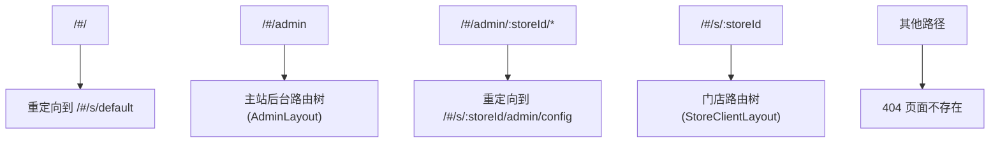
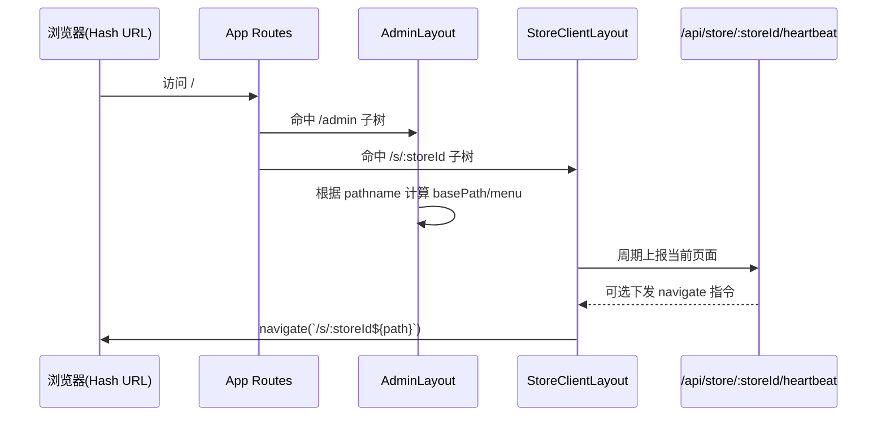

本页聚焦于**前端路由层本身**：系统如何在一个 React 应用里同时承载「主站后台」与「多门店前台」，并用 `HashRouter` 保持部署兼容性与路径稳定性。这里不展开后台权限细节或数据模型，只讨论路由命名空间、重定向策略与布局挂载关系。  
Sources: [App.jsx](src/App.jsx#L2-L77)

## 一、先看第一原则：两条主干路由 + 一个兼容入口

从 `App.jsx` 可以抽象出三类路径：`/admin`（主站后台）、`/s/:storeId`（多租户门店空间）、`/admin/:storeId/*`（历史兼容重定向），并由 `*` 兜底 404。这个结构把“平台级管理”和“门店级体验”硬隔离为不同前缀，避免路径语义混淆。  
Sources: [App.jsx](src/App.jsx#L28-L75)

Sources: [App.jsx](src/App.jsx#L38-L75)

## 二、为什么是 HashRouter：路径稳定优先于服务端重写依赖

应用根路由使用 `HashRouter`，意味着实际访问路径位于 `#` 之后（例如 `/#/admin`、`/#/s/default`）。对静态托管环境而言，这样可减少对 Nginx/Node history fallback 的强依赖，前端自行完成路径解析和页面切换。  
Sources: [App.jsx](src/App.jsx#L2-L3), [App.jsx](src/App.jsx#L35-L76)

## 三、主站后台路由：固定在 /admin 命名空间

主站后台集中挂在 `/admin` 下，使用 `AdminLayout` 作为父布局，子路由包含概览、内容管理、喜报配置、分站管理、信源监控、素材与运势等入口。该结构体现的是“统一后台壳 + Outlet 子页面”的经典嵌套路由模式。  
Sources: [App.jsx](src/App.jsx#L42-L51), [AdminLayout.jsx](src/admin/AdminLayout.jsx#L2-L5), [AdminLayout.jsx](src/admin/AdminLayout.jsx#L262-L264)

## 四、多租户门店路由：/s/:storeId 作为租户作用域

门店端统一进入 `/s/:storeId`，并在该作用域下继续分发多个页面（默认样式页、各风格页、`lotto`、`calculator`、`scratch`）。这意味着 `storeId` 既是 URL 的租户标识，也是前端组件获取上下文的核心参数。  
Sources: [App.jsx](src/App.jsx#L54-L70), [StoreClientLayout.jsx](src/components/StoreClientLayout.jsx#L8-L10)

## 五、兼容路由：旧入口 /admin/:storeId/* 自动归一到新结构

`AdminRedirect` 读取 `storeId` 后，将旧式入口重定向到 `/s/:storeId/admin/config`。这说明当前体系保留了历史链接兼容层，避免外部书签或旧跳转地址失效，同时推动路径语义向新租户前缀收敛。  
Sources: [App.jsx](src/App.jsx#L28-L31), [App.jsx](src/App.jsx#L39-L40)

## 六、路由上下文如何驱动布局行为（模块交互视角）

`AdminLayout` 通过 `location.pathname.startsWith('/admin')` 判断是否主站上下文，并据此生成不同菜单基路径；`StoreClientLayout` 则通过 `useParams().storeId` 发送门店心跳，并可根据服务端命令执行租户内导航。这两者都说明：**路径不仅是页面定位，还直接参与运行时行为分支**。  
Sources: [AdminLayout.jsx](src/admin/AdminLayout.jsx#L6-L14), [AdminLayout.jsx](src/admin/AdminLayout.jsx#L15-L34), [StoreClientLayout.jsx](src/components/StoreClientLayout.jsx#L15-L30)

Sources: [App.jsx](src/App.jsx#L35-L76), [AdminLayout.jsx](src/admin/AdminLayout.jsx#L11-L34), [StoreClientLayout.jsx](src/components/StoreClientLayout.jsx#L19-L53)

## 七、路由模式对照表（仅路由层）

| 路由模式 | 作用 | 父布局 | 典型子路径 | 备注 |
|---|---|---|---|---|
| `/` | 入口归一 | 无 | 重定向到 `/s/default` | 保证有默认租户落点 |
| `/admin` | 主站后台 | `AdminLayout` | `config`、`sub-sites`、`crawler` | 平台级管理 |
| `/s/:storeId` | 门店租户空间 | `StoreClientLayout` | `style-*`、`lotto`、`scratch` | 同构多租户 |
| `/admin/:storeId/*` | 兼容入口 | `AdminRedirect` | -> `/s/:storeId/admin/config` | 历史地址兼容 |
| `*` | 兜底 | 无 | 404 | 非法路径收敛 |

Sources: [App.jsx](src/App.jsx#L28-L75)

## 八、当前设计的边界与下一跳阅读

就本页范围可确认：该项目已经完成“**路由命名空间隔离 + 租户参数化 + 兼容重定向**”三件核心事；如果你要继续理解 storeId 如何贯穿前后台隔离，请读 [多门店承载模型：storeId 作用域下的前台与后台隔离](15-duo-men-dian-cheng-zai-mo-xing-storeid-zuo-yong-yu-xia-de-qian-tai-yu-hou-tai-ge-chi)；如果要看后台菜单与鉴权如何基于路由展开，请读 [后台框架设计：菜单分层、主站特权页与分站登录鉴权](20-hou-tai-kuang-jia-she-ji-cai-dan-fen-ceng-zhu-zhan-te-quan-ye-yu-fen-zhan-deng-lu-jian-quan)。