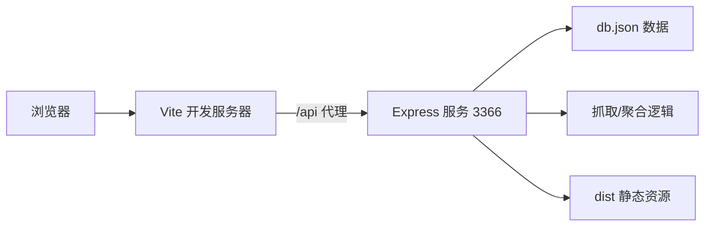

如果你是第一次接触这个项目，**这一页只做一件事：让你在本地把“前端展示端 + Node 服务端”跑起来，并能访问到核心页面**。你不需要先理解全部业务细节，先跑通最小闭环，再进入后续章节。  
Sources: [package.json](package.json#L6-L11) [server/package.json](server/package.json#L6-L9) [src/App.jsx](src/App.jsx#L35-L75)

## 你现在要启动的最小系统

这个项目本地运行时，前端由 Vite 提供开发服务，后端由 `server/index.js` 提供 API 与静态托管能力；前端开发环境通过 `/api` 代理到后端 `3366` 端口。  
Sources: [vite.config.js](vite.config.js#L26-L34) [server/index.js](server/index.js#L133-L143) [server/index.js](server/index.js#L2949-L2951)



上图表示：你在浏览器访问前端页面时，页面请求 API 会经 Vite 转发到 Express；Express 同时负责数据接口与静态资源回退（非 `/api` 路径返回 `index.html`）。  
Sources: [vite.config.js](vite.config.js#L26-L34) [server/index.js](server/index.js#L155-L163) [server/index.js](server/index.js#L2940-L2947)

## 5 分钟启动步骤

先安装依赖：根目录有一套前端依赖与脚本，`server` 子目录也有独立脚本和依赖定义，因此建议两边都安装。  
Sources: [package.json](package.json#L1-L11) [server/package.json](server/package.json#L1-L9)

| 步骤 | 终端位置 | 命令 | 目的 |
|---|---|---|---|
| 1 | 项目根目录 | `npm install` | 安装前端/Vite 依赖 |
| 2 | `server` 目录 | `npm install` | 安装服务端依赖 |
| 3 | `server` 目录 | `npm run dev` | 启动 Node 服务（nodemon） |
| 4 | 项目根目录 | `npm run dev` | 启动 Vite 开发服务 |

Sources: [package.json](package.json#L6-L11) [server/package.json](server/package.json#L6-L22)

## 启动后先验证这 4 个入口

路由使用 `HashRouter`，所以你会看到 URL 中带 `#/`。默认首页会重定向到 `/s/default`。  
Sources: [src/App.jsx](src/App.jsx#L2-L3) [src/App.jsx](src/App.jsx#L35-L39) [src/App.jsx](src/App.jsx#L54-L75)

| 访问地址（在你的 Vite 本地地址后拼接） | 预期结果 |
|---|---|
| `/#/s/default` | 门店前台默认门户 |
| `/#/s/default/lotto` | 大乐透主页 |
| `/#/s/default/scratch` | 刮刮乐页面 |
| `/#/admin` | 统一后台入口 |

Sources: [src/App.jsx](src/App.jsx#L42-L50) [src/App.jsx](src/App.jsx#L54-L70)

## 可视化项目结构（Quick Start 只需认这几层）

先把注意力放在这 4 个位置：`src`（前端页面）、`server`（后端 API）、`vite.config.js`（本地代理）、两个 `package.json`（启动脚本）。  
Sources: [package.json](package.json#L6-L11) [server/package.json](server/package.json#L6-L9) [vite.config.js](vite.config.js#L26-L34)

```text
.
├─ src/
│  ├─ App.jsx                 # 路由总入口
│  ├─ main.jsx                # React 挂载入口
│  ├─ pages/                  # 前台页面
│  └─ admin/                  # 后台页面
├─ server/
│  ├─ index.js                # Express 服务入口
│  ├─ db.json                 # 本地数据文件
│  └─ drawHistory.js          # 开奖历史聚合
├─ package.json               # 前端脚本
└─ vite.config.js             # /api 代理到 3366
```

Sources: [src/main.jsx](src/main.jsx#L1-L6) [src/App.jsx](src/App.jsx#L33-L79) [server/index.js](server/index.js#L136-L137) [vite.config.js](vite.config.js#L26-L34)

## 常见启动问题（新手高频）

如果前端页面能开但接口报错，优先检查后端是否启动在 `3366`（与 Vite 代理一致）；如果路由 404，检查是否用了 `/#/` 形式访问（HashRouter）。  
Sources: [vite.config.js](vite.config.js#L29-L33) [server/index.js](server/index.js#L135-L136) [src/App.jsx](src/App.jsx#L35-L38) [src/App.jsx](src/App.jsx#L74-L75)

| 现象 | 可验证原因 | 快速处理 |
|---|---|---|
| 前端有界面但 API 失败 | `/api` 代理目标是 `127.0.0.1:3366`，后端未运行 | 在 `server` 目录执行 `npm run dev` |
| 刷新后进入空白或找不到页面 | 前端是 Hash 路由，不是 history 路由 | 使用 `/#/s/default` 这类地址 |
| 数据更新不及时 | 服务端对 `data.json` 显式禁用缓存逻辑 | 确认请求命中服务端 `data.json` 路由 |

Sources: [vite.config.js](vite.config.js#L29-L33) [server/package.json](server/package.json#L6-L9) [src/App.jsx](src/App.jsx#L35-L39) [server/index.js](server/index.js#L145-L151)

## 建议下一步阅读顺序

当你已经跑通本页后，推荐按这个顺序继续：先看架构分工，再看本地联调，再看访问路径细节。  
Sources: [src/App.jsx](src/App.jsx#L35-L75) [vite.config.js](vite.config.js#L26-L34) [server/index.js](server/index.js#L153-L163)

1. [项目结构速览：前端展示端、后台管理端与抓取服务的协作关系](3-xiang-mu-jie-gou-su-lan-qian-duan-zhan-shi-duan-hou-tai-guan-li-duan-yu-zhua-qu-fu-wu-de-xie-zuo-guan-xi)  
2. [本地开发工作流：Vite 前端调试、Node 服务启动与联调方式](4-ben-di-kai-fa-gong-zuo-liu-vite-qian-duan-diao-shi-node-fu-wu-qi-dong-yu-lian-diao-fang-shi)  
3. [核心访问路径：门店前台、统一后台与多门店路由约定](5-he-xin-fang-wen-lu-jing-men-dian-qian-tai-tong-hou-tai-yu-duo-men-dian-lu-you-yue-ding)