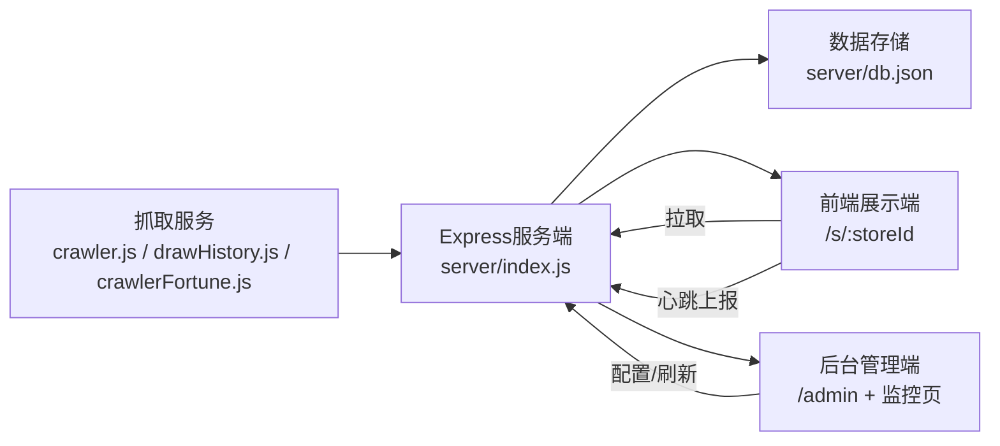

这页是你在「Get Started」阶段的**结构认知页**：目标不是讲细节实现，而是先建立一个稳定的整体心智模型——这个仓库由 React 前端（展示端+管理端路由）、Express 服务端（统一 API 与静态托管）、抓取模块（开奖/资讯/运势采集）三部分协作组成。Sources: [App.jsx](src/App.jsx#L1-L79), [index.js](server/index.js#L133-L171), [crawler.js](server/crawler.js#L147-L200), [crawlerFortune.js](server/crawlerFortune.js#L128-L157)

你当前所在位置是 [项目结构速览：前端展示端、后台管理端与抓取服务的协作关系](3-xiang-mu-jie-gou-su-lan-qian-duan-zhan-shi-duan-hou-tai-guan-li-duan-yu-zhua-qu-fu-wu-de-xie-zuo-guan-xi)，它承接 [Quick Start](2-quick-start)，并为后续 [本地开发工作流：Vite 前端调试、Node 服务启动与联调方式](4-ben-di-kai-fa-gong-zuo-liu-vite-qian-duan-diao-shi-node-fu-wu-qi-dong-yu-lian-diao-fang-shi) 和 [核心访问路径：门店前台、统一后台与多门店路由约定](5-he-xin-fang-wen-lu-jing-men-dian-qian-tai-tong-hou-tai-yu-duo-men-dian-lu-you-yue-ding)。Sources: [main.jsx](src/main.jsx#L40-L46), [App.jsx](src/App.jsx#L35-L75)

## 先看全景：三端协作图（入门版）

在看图前先约定：图里“前端展示端”指 `/s/:storeId` 下的门店页面；“后台管理端”指 `/admin` 及分站后台入口；“抓取服务”是 `server/crawler*.js + drawHistory.js` 这类采集模块，由服务端入口统一编排并对前端暴露 API。Sources: [App.jsx](src/App.jsx#L42-L71), [crawler.js](server/crawler.js#L147-L200), [drawHistory.js](server/drawHistory.js#L105-L137), [index.js](server/index.js#L11-L18)



该图对应代码中的事实是：前端页面通过 `fetch('/api/...')` 拉取数据，后台监控页也走同一组 `/api/system/*` 与 `/api/super/*` 接口，服务端负责静态资源托管、`data.json` 特殊 no-cache 输出以及抓取结果组织。Sources: [Home.jsx](src/pages/Home.jsx#L211-L279), [CrawlerMonitor.jsx](src/admin/CrawlerMonitor.jsx#L38-L68), [CrawlerMonitor.jsx](src/admin/CrawlerMonitor.jsx#L163-L179), [index.js](server/index.js#L144-L163)

## 仓库结构可视化（只保留协作主干）

```text
CJDLT/
├─ src/                      # React 前端
│  ├─ pages/                 # 门店展示页（Home/Scratch/Portal）
│  ├─ admin/                 # 后台管理页（Dashboard/CrawlerMonitor等）
│  ├─ components/
│  │  └─ StoreClientLayout   # 门店侧心跳上报与指令接收
│  └─ App.jsx                # 路由总入口
├─ server/                   # Express + 抓取模块
│  ├─ index.js               # API入口、静态托管、DB迁移
│  ├─ drawHistory.js         # 开奖历史聚合
│  ├─ crawler.js             # 资讯/公益金/开奖抓取编排
│  └─ crawlerFortune.js      # 运势抓取
├─ public/                   # 前端静态资源
└─ package.json              # 前后端共用依赖声明
```

这个结构说明项目是“**单仓多职责**”：前端代码在 `src/`，服务能力与采集逻辑在 `server/`，并通过统一依赖（如 `express`、`axios`、`puppeteer`、`react`）协同运行。Sources: [package.json](package.json#L6-L47), [App.jsx](src/App.jsx#L1-L79), [index.js](server/index.js#L1-L18), [crawler.js](server/crawler.js#L1-L8)

## 三个角色各做什么（新手对照表）

| 角色 | 主要目录 | 核心职责 | 对外表现 |
|---|---|---|---|
| 前端展示端 | `src/pages`、`src/components` | 展示开奖、门店信息、互动页；定时心跳上报 | `/s/:storeId` 路由下多页面 |
| 后台管理端 | `src/admin` | 配置门店内容、查看抓取状态、触发刷新与参数保存 | `/admin` 下统一管理入口 |
| 抓取服务 + API层 | `server/index.js` + `server/*.js` | 抓取外部数据、组织输出、读写本地 DB、提供 API | `/api/*` 接口与静态资源服务 |

Sources: [App.jsx](src/App.jsx#L42-L71), [StoreClientLayout.jsx](src/components/StoreClientLayout.jsx#L15-L53), [CrawlerMonitor.jsx](src/admin/CrawlerMonitor.jsx#L38-L68), [index.js](server/index.js#L133-L171), [drawHistory.js](server/drawHistory.js#L105-L137)

## 一条典型协作链路：开奖数据如何到达门店页面

第一步，服务端聚合开奖历史：`drawHistory.js` 会并行拉取国家/福建来源并标准化成统一 `games` 结构。Sources: [drawHistory.js](server/drawHistory.js#L24-L37), [drawHistory.js](server/drawHistory.js#L55-L103), [drawHistory.js](server/drawHistory.js#L105-L133)

第二步，前端展示页在加载时请求 `/api/system/draw-history`，再从返回结果里取 `dlt` 游戏，映射为页面使用的 `latest/history` 状态。Sources: [Home.jsx](src/pages/Home.jsx#L211-L255)

第三步，同一页面再请求 `/api/store/:storeId` 拉取门店配置（例如门店状态），实现“同一前台模板+不同门店数据”的渲染。Sources: [Home.jsx](src/pages/Home.jsx#L259-L280)

第四步，门店布局组件每 10 秒上报 `/api/store/:storeId/heartbeat`，并可接收服务端下发的跳转命令与公告配置，实现展示端与管理端间的运行时联动。Sources: [StoreClientLayout.jsx](src/components/StoreClientLayout.jsx#L19-L53), [StoreClientLayout.jsx](src/components/StoreClientLayout.jsx#L55-L60)

## 入门级“接口观察点”表（你会最先碰到）

| 接口/路径 | 谁在调用 | 用途 |
|---|---|---|
| `/api/system/draw-history` | 门店展示页、监控页 | 获取开奖历史数据（支持 size/force 参数场景） |
| `/api/system/sources` | 监控页、门户页 | 获取抓取后的综合信源数据 |
| `/api/system/sources/refresh` | 监控页 | 手动触发抓取刷新 |
| `/api/store/:storeId` | 展示页、后台布局 | 拉取门店配置/校验门店存在 |
| `/api/store/:storeId/heartbeat` | 门店布局容器 | 心跳上报并接收服务端指令 |
| `/api/store/login` | 分站后台 | 分站后台登录鉴权 |

Sources: [Home.jsx](src/pages/Home.jsx#L211-L280), [CrawlerMonitor.jsx](src/admin/CrawlerMonitor.jsx#L38-L68), [CrawlerMonitor.jsx](src/admin/CrawlerMonitor.jsx#L163-L179), [StoreClientLayout.jsx](src/components/StoreClientLayout.jsx#L19-L40), [AdminLayout.jsx](src/admin/AdminLayout.jsx#L67-L75), [AdminLayout.jsx](src/admin/AdminLayout.jsx#L121-L137), [StorePortal.jsx](src/pages/StorePortal.jsx#L55-L63)

## 下一步建议阅读（按最顺路线）

如果你已经理解这页的“三端协作关系”，建议按这个顺序继续：先看 [本地开发工作流：Vite 前端调试、Node 服务启动与联调方式](4-ben-di-kai-fa-gong-zuo-liu-vite-qian-duan-diao-shi-node-fu-wu-qi-dong-yu-lian-diao-fang-shi)，再看 [核心访问路径：门店前台、统一后台与多门店路由约定](5-he-xin-fang-wen-lu-jing-men-dian-qian-tai-tong-hou-tai-yu-duo-men-dian-lu-you-yue-ding)，这样你会把“结构图”转化成“可运行认知”。Sources: [App.jsx](src/App.jsx#L35-L77), [package.json](package.json#L6-L11)