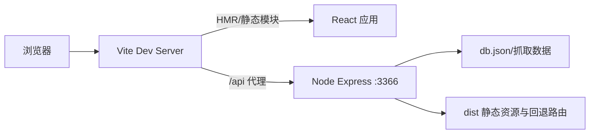
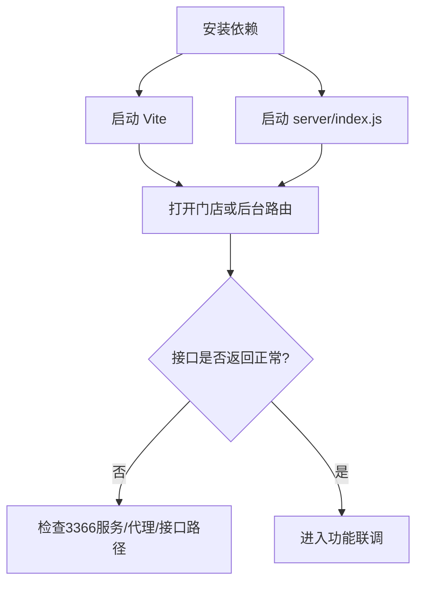

本页只解决一个问题：在本仓库中，如何稳定地启动**前端 Vite 调试环境**与**Node API 服务**，并完成同机联调（含路由访问与常见故障定位），不展开部署、架构深潜或业务细节。  
Sources: [package.json](package.json#L6-L11), [vite.config.js](vite.config.js#L26-L34), [server/package.json](server/package.json#L6-L9)

这个项目的本地开发是典型“双进程”模式：前端通过 `npm run dev` 启动 Vite，后端通过 `server/index.js` 启动 Express；前端所有 `/api` 请求会被 Vite 代理到 `127.0.0.1:3366`，因此联调关键是**两个进程必须同时在线**。  
Sources: [package.json](package.json#L6-L11), [vite.config.js](vite.config.js#L26-L33), [server/index.js](server/index.js#L133-L136), [src/admin/CrawlerMonitor.jsx](src/admin/CrawlerMonitor.jsx#L39-L41)

## 你当前在文档路径中的位置与建议阅读顺序

你当前位于 [本地开发工作流：Vite 前端调试、Node 服务启动与联调方式](4-ben-di-kai-fa-gong-zuo-liu-vite-qian-duan-diao-shi-node-fu-wu-qi-dong-yu-lian-diao-fang-shi)。建议先读上一页 [项目结构速览：前端展示端、后台管理端与抓取服务的协作关系](3-xiang-mu-jie-gou-su-lan-qian-duan-zhan-shi-duan-hou-tai-guan-li-duan-yu-zhua-qu-fu-wu-de-xie-zuo-guan-xi)，再进入下一页 [核心访问路径：门店前台、统一后台与多门店路由约定](5-he-xin-fang-wen-lu-jing-men-dian-qian-tai-tong-hou-tai-yu-duo-men-dian-lu-you-yue-ding)。  
Sources: [src/App.jsx](src/App.jsx#L35-L77)

## 本地联调架构总览（先看全局）

在开发态下，浏览器访问 Vite；Vite 负责 HMR 与前端资源，`/api` 自动代理给 Node 服务；Node 同时承载 API、`dist` 静态托管和非 API 回退路由（生产式访问）。这意味着“页面能打开但接口失败”通常是 Node 未启动，而不是前端路由错误。  
Sources: [vite.config.js](vite.config.js#L26-L34), [server/index.js](server/index.js#L153-L163), [server/index.js](server/index.js#L2940-L2949)


Sources: [vite.config.js](vite.config.js#L26-L34), [server/index.js](server/index.js#L135-L136), [server/index.js](server/index.js#L153-L163), [server/index.js](server/index.js#L2940-L2947)

## 开发相关目录（最小必知）

本页工作流只需要盯住以下目录与文件；它们对应“启动命令—代理—路由—接口请求”完整链路。  
Sources: [package.json](package.json#L6-L11), [server/package.json](server/package.json#L6-L9), [vite.config.js](vite.config.js#L26-L34), [src/App.jsx](src/App.jsx#L35-L77), [src/pages/Home.jsx](src/pages/Home.jsx#L211-L280)

```text
.
├─ package.json              # 前端 dev/build 脚本
├─ vite.config.js            # /api -> 127.0.0.1:3366 代理
├─ src/
│  ├─ App.jsx                # HashRouter 路由入口
│  ├─ main.jsx               # 挂载 + ErrorBoundary
│  ├─ pages/Home.jsx         # 门店页联调请求示例
│  └─ admin/CrawlerMonitor.jsx # 后台联调请求示例
└─ server/
   ├─ package.json           # 后端 start/dev 脚本
   ├─ index.js               # Express 监听3366，API与静态托管
   └─ db.json                # 本地数据文件
```
Sources: [package.json](package.json#L6-L11), [server/package.json](server/package.json#L6-L9), [server/index.js](server/index.js#L135-L137)

## 标准启动步骤（Windows 本地）

按顺序执行：先安装根目录依赖，再安装 `server` 依赖，然后分别启动前端与后端。`server` 提供 `dev`（nodemon）与 `start`（node）两种模式。  
Sources: [package.json](package.json#L6-L11), [server/package.json](server/package.json#L6-L9), [server/package.json](server/package.json#L20-L22)

| 步骤 | 终端位置 | 命令 | 目的 |
|---|---|---|---|
| 1 | 项目根目录 | `npm install` | 安装前端与共享依赖 |
| 2 | `server/` | `npm install` | 安装后端依赖（含 nodemon） |
| 3 | 项目根目录 | `npm run dev` | 启动 Vite 开发服务 |
| 4 | `server/` | `npm run dev` 或 `npm start` | 启动 Express API（3366） |
| 5 | 浏览器 | 访问 Vite 输出地址 + `/#/s/default` | 进入默认门店前台 |

Sources: [package.json](package.json#L6-L11), [server/package.json](server/package.json#L6-L9), [src/App.jsx](src/App.jsx#L38-L39), [src/App.jsx](src/App.jsx#L54-L56)

你也可以使用 `restart_services.bat` 一键重启：它会先 `taskkill /F /IM node.exe`，再后台启动 `node server/index.js` 与 `npm run dev`。该方式效率高，但会终止机器上所有 Node 进程。  
Sources: [restart_services.bat](restart_services.bat#L1-L12)


Sources: [vite.config.js](vite.config.js#L26-L34), [server/index.js](server/index.js#L2949-L2951), [src/pages/Home.jsx](src/pages/Home.jsx#L213-L214)

## 联调时的访问入口（前台 + 后台）

前端使用 `HashRouter`，默认会把 `/` 重定向到 `/s/default`；后台为 `/admin`，多门店后台路由为 `/s/:storeId/admin/...`（其中 `/admin/:storeId/*` 会被重定向到对应分站配置页）。  
Sources: [src/App.jsx](src/App.jsx#L35-L45), [src/App.jsx](src/App.jsx#L54-L70), [src/App.jsx](src/App.jsx#L28-L31)

`Home.jsx` 和 `StoreConfig/CrawlerMonitor` 都使用相对路径调用 `/api/...`，这正是本地代理生效的前提；只要前端在 Vite、后端在 3366，联调无需手填 API 域名。  
Sources: [src/pages/Home.jsx](src/pages/Home.jsx#L213-L214), [src/pages/Home.jsx](src/pages/Home.jsx#L261-L262), [src/admin/StoreConfig.jsx](src/admin/StoreConfig.jsx#L187-L195), [src/admin/CrawlerMonitor.jsx](src/admin/CrawlerMonitor.jsx#L39-L41)

## 关键配置对照表（调试时最常看）

| 关注点 | 当前实现 | 调试含义 |
|---|---|---|
| 前端启动脚本 | `vite --host` | 可局域网访问开发服务 |
| 后端端口 | `process.env.PORT || 3366` | 本地默认 3366 |
| 代理规则 | `/api -> http://127.0.0.1:3366` | 前端请求无需改地址 |
| 路由模式 | `HashRouter` | 访问路径带 `/#/` |
| 后端静态托管 | `../dist` + 非 `/api` 回退 | 用于构建后运行，不是 Vite HMR 链路 |

Sources: [package.json](package.json#L6-L8), [vite.config.js](vite.config.js#L26-L33), [server/index.js](server/index.js#L135-L136), [src/App.jsx](src/App.jsx#L35-L36), [server/index.js](server/index.js#L153-L163), [server/index.js](server/index.js#L2940-L2947)

## “错误方式 vs 正确方式”联调对比（Before/After）

| 场景 | Before（常见错误） | After（推荐做法） |
|---|---|---|
| 只开前端 | 只执行 `npm run dev`，页面可开但 `/api` 报错 | 同时启动 `server/index.js`（`npm run dev`/`npm start`） |
| 路由访问 | 直接访问非 Hash 路径导致空白/404认知偏差 | 使用 `/#/s/default`、`/#/admin` 等 Hash 路由 |
| 快速重启 | 手动逐个关进程，容易漏掉 | Windows 可用 `restart_services.bat` 快速重启（注意会杀全部 node） |

Sources: [package.json](package.json#L6-L11), [server/package.json](server/package.json#L6-L9), [src/App.jsx](src/App.jsx#L35-L39), [restart_services.bat](restart_services.bat#L1-L12)

## 常见问题排查（联调向）

| 现象 | 高概率原因 | 最小验证动作 |
|---|---|---|
| 页面打开但数据不刷新 | Node API 未启动或 3366 不通 | 看后端是否打印 `Server running on port 3366` |
| `/api/...` 404/失败 | 代理目标不可达 | 核对 `vite.config.js` 代理到 `127.0.0.1:3366` |
| 数据“像没更新” | 命中缓存认知偏差 | 关注 `/data.json` 与 `index.html` 已被显式 no-cache 处理 |
| 前端白屏难定位 | 组件异常被吞 | 查看 `main.jsx` 的 ErrorBoundary 输出 |

Sources: [server/index.js](server/index.js#L2949-L2951), [vite.config.js](vite.config.js#L29-L33), [server/index.js](server/index.js#L145-L151), [server/index.js](server/index.js#L157-L161), [src/main.jsx](src/main.jsx#L7-L20), [src/main.jsx](src/main.jsx#L23-L33)

## 下一步建议（只关联目录中的后续页）

完成本页后，建议先读 [核心访问路径：门店前台、统一后台与多门店路由约定](5-he-xin-fang-wen-lu-jing-men-dian-qian-tai-tong-hou-tai-yu-duo-men-dian-lu-you-yue-ding) 来建立访问认知，再进入 [环境依赖说明：Node、前端依赖、服务端依赖与常见兼容点](9-huan-jing-yi-lai-shuo-ming-node-qian-duan-yi-lai-fu-wu-duan-yi-lai-yu-chang-jian-jian-rong-dian) 做环境一致性校验。