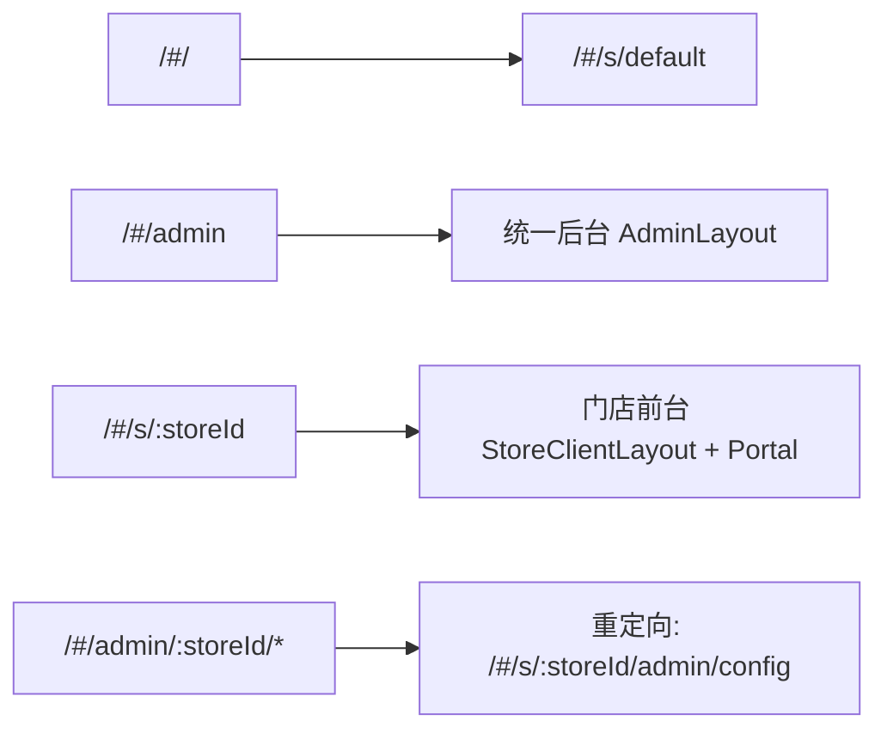

这页聚焦你当前所在位置 **[核心访问路径：门店前台、统一后台与多门店路由约定](5-he-xin-fang-wen-lu-jing-men-dian-qian-tai-tong-hou-tai-yu-duo-men-dian-lu-you-yue-ding)**，目标是先把“从哪个 URL 进入哪个系统区域”讲清楚：统一后台入口、门店前台入口、多门店参数化入口，以及这些入口背后的最小鉴权与心跳机制。Sources: [App.jsx](src/App.jsx#L33-L77) [StoreClientLayout.jsx](src/components/StoreClientLayout.jsx#L7-L60) [AdminLayout.jsx](src/admin/AdminLayout.jsx#L36-L206)

## 先建立访问心智模型（从 URL 到页面上下文）

应用使用 `HashRouter`，这意味着浏览器实际访问时会以 `#/...` 形式定位前端路由；因此“路径约定”本质是 hash 段约定，而非服务器真实目录结构。根路径会被重定向到默认门店：`/ -> /s/default`。Sources: [App.jsx](src/App.jsx#L35-L39)

系统把访问面分成两类：**统一后台**（`/admin`）和**多门店前台**（`/s/:storeId`），并给出一个“兼容入口”`/admin/:storeId/*`，会重定向到 `/s/:storeId/admin/config`。这体现了“单入口后台 + 多租户前台”的路由骨架。Sources: [App.jsx](src/App.jsx#L39-L55)


Sources: [App.jsx](src/App.jsx#L35-L55)

## 访问路径总览表（开发者最常用）

| 访问目标 | 路径模式（HashRouter） | 典型示例 | 页面装配 |
|---|---|---|---|
| 默认门店前台 | `/#/`（自动跳转） | `http://localhost:5173/#/` | 跳转到 `/#/s/default` |
| 指定门店前台 | `/#/s/:storeId` | `/#/s/fuzhou001` | `StoreClientLayout` + 默认 `PortalStyleSports` |
| 门店选号页 | `/#/s/:storeId/lotto` | `/#/s/fuzhou001/lotto` | `Home` |
| 门店计算器 | `/#/s/:storeId/calculator` | `/#/s/fuzhou001/calculator` | `Calculator` |
| 门店刮刮乐 | `/#/s/:storeId/scratch` | `/#/s/fuzhou001/scratch` | `ScratchCard` |
| 统一后台 | `/#/admin` | `/#/admin` | `AdminLayout` + `Dashboard` |
| 统一后台配置 | `/#/admin/config` | `/#/admin/config` | `StoreConfig` |
| 兼容后台入口 | `/#/admin/:storeId/*` | `/#/admin/fuzhou001/any` | 重定向到 `/#/s/:storeId/admin/config` |
| 未匹配路径 | `*` | `/#/xxx` | 前端 404 文案 |

Sources: [App.jsx](src/App.jsx#L37-L75)

## 多门店路由约定：`storeId` 是第一层作用域

`/s/:storeId` 下挂载了门店前台全部页面（多种风格页、lotto、calculator、scratch），所以 **storeId 是前台所有业务页的作用域锚点**；页面内部通过 `useParams()` 读取 `storeId`，再按门店拉配置。Sources: [App.jsx](src/App.jsx#L53-L70) [Home.jsx](src/pages/Home.jsx#L42-L46)

`StoreClientLayout` 会在门店上下文中周期上报心跳：`POST /api/store/:storeId/heartbeat`，并可接收后台下发的 `navigate` 命令后在当前门店前缀内跳转（`/s/${storeId}${path}`）；这保证了“跨页面控制”仍受门店作用域约束。Sources: [StoreClientLayout.jsx](src/components/StoreClientLayout.jsx#L15-L53)

## 统一后台与分站后台的入口约定（按代码现状）

统一后台在路由层显式注册为 `/admin`，其菜单包含概览、内容管理、喜报配置，以及仅主站可见的分站管理/图片素材/信源监控/今日运势。Sources: [App.jsx](src/App.jsx#L41-L51) [AdminLayout.jsx](src/admin/AdminLayout.jsx#L21-L30)

`AdminLayout` 内部同时支持“主站后台”和“分站后台”两种上下文判断：当路径以 `/admin` 开头时视为主站，否则按 `routeStoreId` 计算分站 `basePath`，并启用分站登录态与超时控制（`sessionStorage` 中的 `auth/storeKey/lastActive`）。Sources: [AdminLayout.jsx](src/admin/AdminLayout.jsx#L10-L14) [AdminLayout.jsx](src/admin/AdminLayout.jsx#L36-L59)

分站登录调用 `POST /api/store/login`，后端按 `id + adminKey` 校验；前台公开配置读取使用 `GET /api/store/:id`（返回时剔除 `adminKey`），因此访问链路上“浏览态”和“管理态”是分离的。Sources: [AdminLayout.jsx](src/admin/AdminLayout.jsx#L121-L146) [index.js](server/index.js#L671-L681) [index.js](server/index.js#L810-L821)

## 与访问路径直接相关的后端接口（最小集）

| 接口 | 方法 | 路径 | 与访问路径关系 |
|---|---|---|---|
| 门店登录 | POST | `/api/store/login` | 分站后台进入前的密钥校验 |
| 门店公开配置 | GET | `/api/store/:id` | `/#/s/:storeId` 页面初始化所需配置 |
| 门店心跳 | POST | `/api/store/:id/heartbeat` | 在线状态、待执行导航命令、公告下发 |
| 超管下发命令 | POST | `/api/super/store/:id/command` | 给指定门店设备注入待执行命令 |

Sources: [index.js](server/index.js#L671-L681) [index.js](server/index.js#L810-L859) [index.js](server/index.js#L883-L932)

## 相关目录的“访问路径实现位”速览

```text
src/
├─ App.jsx                      # 路由总入口（统一后台+多门店前台）
├─ components/
│  └─ StoreClientLayout.jsx     # 门店作用域容器、心跳、远程导航
├─ admin/
│  └─ AdminLayout.jsx           # 后台框架、登录态与菜单
└─ pages/
   ├─ Home.jsx                  # /s/:storeId/lotto
   ├─ ScratchCard.jsx           # /s/:storeId/scratch
   └─ PortalStyleSports.jsx     # /s/:storeId 默认首页
server/
└─ index.js                     # /api/store/* 与 heartbeat 等接口
```
Sources: [App.jsx](src/App.jsx#L1-L27) [StoreClientLayout.jsx](src/components/StoreClientLayout.jsx#L1-L10) [AdminLayout.jsx](src/admin/AdminLayout.jsx#L1-L6) [index.js](server/index.js#L663-L667)

## 常见访问问题快速对照

| 现象 | 优先检查点 | 代码依据 |
|---|---|---|
| 打开根地址不是业务页 | 是否被自动跳到 `/#/s/default` | 根路由重定向 |
| 门店页加载但内容异常 | URL 是否带合法 `storeId`，后端 `GET /api/store/:id` 是否 404 | 门店配置接口按 id 查找 |
| 分站后台反复回登录页 | `sessionStorage` 的 `lastActive` 是否超 5 分钟 | `TIMEOUT_MS = 5 * 60 * 1000` |
| 页面提示 404 | 前端路由未匹配到 `Route` | `*` fallback |

Sources: [App.jsx](src/App.jsx#L38-L39) [index.js](server/index.js#L816-L818) [AdminLayout.jsx](src/admin/AdminLayout.jsx#L37-L55) [App.jsx](src/App.jsx#L73-L75)

## 下一步阅读建议（按目录顺序）

读完本页后，建议按“从入口到实现细节”的顺序继续：先看 [路由体系设计：HashRouter 下的主站后台与多租户门店路由](14-lu-you-ti-xi-she-ji-hashrouter-xia-de-zhu-zhan-hou-tai-yu-duo-zu-hu-men-dian-lu-you)，再看 [多门店承载模型：storeId 作用域下的前台与后台隔离](15-duo-men-dian-cheng-zai-mo-xing-storeid-zuo-yong-yu-xia-de-qian-tai-yu-hou-tai-ge-chi)，最后进入 [后台框架设计：菜单分层、主站特权页与分站登录鉴权](20-hou-tai-kuang-jia-she-ji-cai-dan-fen-ceng-zhu-zhan-te-quan-ye-yu-fen-zhan-deng-lu-jian-quan)。Sources: [App.jsx](src/App.jsx#L33-L77) [AdminLayout.jsx](src/admin/AdminLayout.jsx#L21-L30)