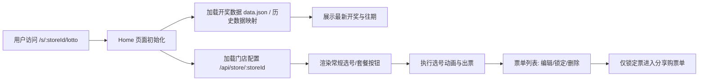

这页是你在「从零上手功能体验」里的第 1 站，目标是让你**不看后端实现细节**也能跑通门店大屏首页的完整体验链路：看开奖 → 选号 → 生成票单 → 锁定并分享购票单。Sources: [App.jsx](src/App.jsx#L54-L69) [Home.jsx](src/pages/Home.jsx#L1143-L1205)

你当前所在位置是 [门店大屏首页体验：开奖信息、选号流程与购票单生成](6-men-dian-da-ping-shou-ye-ti-yan-kai-jiang-xin-xi-xuan-hao-liu-cheng-yu-gou-piao-dan-sheng-cheng)；建议下一步按顺序阅读 [刮刮乐页面体验：互动流程、票面展示与状态切换](7-gua-gua-le-ye-mian-ti-yan-hu-dong-liu-cheng-piao-mian-zhan-shi-yu-zhuang-tai-qie-huan) 和 [后台入口体验：概览、内容管理、喜报配置与监控入口](8-hou-tai-ru-kou-ti-yan-gai-lan-nei-rong-guan-li-xi-bao-pei-zhi-yu-jian-kong-ru-kou)。Sources: [App.jsx](src/App.jsx#L54-L70)

## 1) 先建立地图：这个页面从哪里进、由什么组成

门店大屏首页实际路由是 `/s/:storeId/lotto`，它挂在门店端布局 `StoreClientLayout` 之下，页面主体由 `Home.jsx` 负责渲染与交互。Sources: [App.jsx](src/App.jsx#L54-L69) [StoreClientLayout.jsx](src/components/StoreClientLayout.jsx#L55-L59)

```text
src/
├─ App.jsx                     # 路由入口，声明 /s/:storeId/lotto -> Home
├─ components/
│  └─ StoreClientLayout.jsx    # 门店端外层布局与心跳
└─ pages/
   └─ Home.jsx                 # 本页核心：开奖、选号、票单、分享
```
Sources: [App.jsx](src/App.jsx#L54-L69) [StoreClientLayout.jsx](src/components/StoreClientLayout.jsx#L7-L13) [Home.jsx](src/pages/Home.jsx#L42-L45)


Sources: [App.jsx](src/App.jsx#L54-L69) [Home.jsx](src/pages/Home.jsx#L220-L279) [Home.jsx](src/pages/Home.jsx#L405-L413) [Home.jsx](src/pages/Home.jsx#L536-L565) [Home.jsx](src/pages/Home.jsx#L620-L761) [Home.jsx](src/pages/Home.jsx#L927-L953) [Home.jsx](src/pages/Home.jsx#L1994-L2008)

## 2) 新手实操流程（一步一步点出来）

```mermaid
flowchart TD
S1[进入 /s/{storeId}/lotto] --> S2[确认顶部显示下一期与日期]
S2 --> S3[查看左侧/折叠区最新开奖与历史]
S3 --> S4[点击常规选号或套餐票]
S4 --> S5[等待选号动画完成]
S5 --> S6[右侧/折叠区出现新票单]
S6 --> S7[可编辑号码或锁定]
S7 --> S8[锁定至少1张后点击分享]
S8 --> S9[生成购票单截图内容]
```
Sources: [Home.jsx](src/pages/Home.jsx#L1244-L1252) [Home.jsx](src/pages/Home.jsx#L1143-L1205) [Home.jsx](src/pages/Home.jsx#L1294-L1361) [Home.jsx](src/pages/Home.jsx#L1560-L1637) [Home.jsx](src/pages/Home.jsx#L1654-L1716) [Home.jsx](src/pages/Home.jsx#L435-L499) [Home.jsx](src/pages/Home.jsx#L1813-L1845) [Home.jsx](src/pages/Home.jsx#L1878-L1917) [Home.jsx](src/pages/Home.jsx#L1763-L1801)

实操时建议优先走「常规选号」：点击一个常规按钮后，系统会生成红/蓝球随机组合、执行动画，再把结果追加到票单列表。Sources: [Home.jsx](src/pages/Home.jsx#L536-L565) [Home.jsx](src/pages/Home.jsx#L1369-L1398) [Home.jsx](src/pages/Home.jsx#L1813-L1875)

如果你点的是「套餐票」，系统会按套餐项逐注生成，并按配置节奏播放，过程中会实时更新“正在生成 x/y 注”的状态。Sources: [Home.jsx](src/pages/Home.jsx#L615-L761)

## 3) 你看到的 3 个核心体验模块

| 模块 | 你会看到什么 | 关键数据来源 |
|---|---|---|
| 开奖信息区 | 最新期号、日期、开奖号码、奖池、往期列表 | `drawData`（初始化/映射后） |
| 选号区 | 红球35 + 蓝球12选号动画、常规/套餐按钮 | 随机生成 + 门店配置 `gameConfig` |
| 票单区 | 新增票单、金额汇总、编辑/锁定/删除、分享 | `tickets` 状态 |
Sources: [Home.jsx](src/pages/Home.jsx#L178-L188) [Home.jsx](src/pages/Home.jsx#L1143-L1205) [Home.jsx](src/pages/Home.jsx#L1369-L1398) [Home.jsx](src/pages/Home.jsx#L1555-L1716) [Home.jsx](src/pages/Home.jsx#L1813-L1964)

开奖数据在代码里有两层来源：一层是读取 `/data.json`，另一层是把历史接口结果映射进 `drawData` 结构（含期号、日期、红蓝球、奖池）。Sources: [Home.jsx](src/pages/Home.jsx#L220-L255) [Home.jsx](src/pages/Home.jsx#L405-L413)

## 4) “购票单生成”到底发生了什么（前后状态对照）

| 操作 | 操作前 | 操作后 |
|---|---|---|
| 点击常规选号 | `tickets` 不变，`isRolling=false` | `isRolling=true` 执行动画，结束后新增1张票并计算价格 |
| 点击批量/套餐 | `tickets` 不变 | 循环追加 `bets`，累计 `price`，显示生成进度 |
| 编辑票单并确认 | `editState` 仅临时态 | 回写 `tickets` 指定注，重算票价 |
| 点击锁定 | `locked=false` | 切换为 `locked=true`，进入可分享候选 |
| 点击分享 | 若无锁定票会提示 | 仅锁定票进入分享弹窗内容 |
Sources: [Home.jsx](src/pages/Home.jsx#L522-L565) [Home.jsx](src/pages/Home.jsx#L568-L613) [Home.jsx](src/pages/Home.jsx#L615-L761) [Home.jsx](src/pages/Home.jsx#L860-L925) [Home.jsx](src/pages/Home.jsx#L927-L934) [Home.jsx](src/pages/Home.jsx#L1763-L1794) [Home.jsx](src/pages/Home.jsx#L1994-L2008)

价格计算规则是统一函数 `calculatePrice`：本质是红球组合数 × 蓝球组合数 × 2 元；单式 5+2 会自然得到 2 元。Sources: [Home.jsx](src/pages/Home.jsx#L14-L27)

## 5) 常见“我点了没反应”排查表（新手最常见）

| 现象 | 直接原因 | 先做什么 |
|---|---|---|
| 分享按钮点了弹提示 | 没有锁定任何票 | 先点票上的锁图标，再分享 |
| 编辑按钮不可点 | 票已锁定或正在滚动选号 | 解锁，或等待 `isRolling` 结束 |
| 删除失败 | 正在编辑该票或已锁定 | 先退出编辑/先解锁 |
| 页面显示站点不存在 | `/api/store/:storeId` 返回 404 | 检查 storeId 路径是否正确 |
| 页面显示站点暂停服务 | 门店配置 `status=closed` | 切换可用门店或联系管理员 |
Sources: [Home.jsx](src/pages/Home.jsx#L772-L779) [Home.jsx](src/pages/Home.jsx#L927-L953) [Home.jsx](src/pages/Home.jsx#L978-L1011) [Home.jsx](src/pages/Home.jsx#L261-L276) [Home.jsx](src/pages/Home.jsx#L1418-L1448)

## 6) 本页结束后该看什么

如果你已经能完整走通「开奖查看 → 选号出票 → 锁定分享」，下一步建议看 [刮刮乐页面体验：互动流程、票面展示与状态切换](7-gua-gua-le-ye-mian-ti-yan-hu-dong-liu-cheng-piao-mian-zhan-shi-yu-zhuang-tai-qie-huan)；再进入 [后台入口体验：概览、内容管理、喜报配置与监控入口](8-hou-tai-ru-kou-ti-yan-gai-lan-nei-rong-guan-li-xi-bao-pei-zhi-yu-jian-kong-ru-kou)，形成“前台体验 + 后台配置”的闭环认知。Sources: [App.jsx](src/App.jsx#L67-L70)