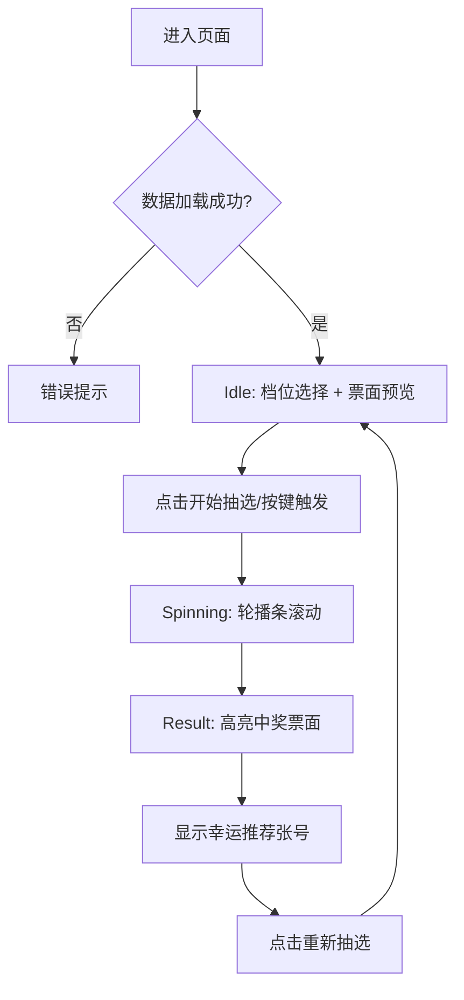

这个页面的目标是让新手开发者**先看懂“用户如何玩”**，再看懂“代码如何把体验拆成状态机 + 数据加载 + 动画结果”三层。你当前所在文档节点是「从零上手功能体验」中的刮刮乐页面，重点仅覆盖 `/s/:storeId/scratch` 这一条前台体验链路。  
Sources: [App.jsx](src/App.jsx#L54-L71), [ScratchCard.jsx](src/pages/ScratchCard.jsx#L28-L39)

## 你在系统中的位置（当前页边界）

刮刮乐页面由门店前台路由直接承载，路由路径是 `/s/:storeId/scratch`，并在多个门店前台模板里通过按钮跳转进入；因此本页不讨论后台管理配置流程，只讨论“进入页面后用户看到什么、点什么、状态怎么变”。  
Sources: [App.jsx](src/App.jsx#L54-L71), [PortalStyleSports.jsx](src/pages/PortalStyleSports.jsx#L2066-L2079), [StorePortal.jsx](src/pages/StorePortal.jsx#L277-L289)

## 架构速览（页面级）

先用一张图建立心智模型：刮刮乐体验不是“纯前端随机”，而是“前端先拉门店配置和刮刮乐票面数据，再在本地做动画与幸运号展示”。  

```mermaid
flowchart LR
    A[门店前台入口按钮] --> B[/s/:storeId/scratch]
    B --> C[加载门店配置 /api/store/:id]
    B --> D[加载票面数据 /api/store/:id/scratch]
    D --> E[按档位组装 tiers 10/20/30/50]
    E --> F[Idle 预览态]
    F --> G[Spinning 抽选动画]
    G --> H[Result 结果态]
    H --> I[显示幸运张号 + 票面名]
```

Sources: [App.jsx](src/App.jsx#L67-L70), [ScratchCard.jsx](src/pages/ScratchCard.jsx#L47-L67), [ScratchCard.jsx](src/pages/ScratchCard.jsx#L74-L118), [server/index.js](server/index.js#L2151-L2190)

## 相关代码结构（只看本页必要文件）

```text
src/
├─ pages/
│  ├─ ScratchCard.jsx          # 刮刮乐页面主逻辑（状态、动画、渲染）
│  ├─ PortalStyleSports.jsx    # 门店前台入口之一（跳转 scratch）
│  └─ StorePortal.jsx          # 门店前台入口之一（跳转 scratch）
├─ App.jsx                     # 路由挂载 /s/:storeId/scratch
server/
└─ index.js                    # /api/store/:id 与 /api/store/:id/scratch 接口
```

Sources: [ScratchCard.jsx](src/pages/ScratchCard.jsx#L28-L421), [PortalStyleSports.jsx](src/pages/PortalStyleSports.jsx#L2066-L2079), [StorePortal.jsx](src/pages/StorePortal.jsx#L277-L289), [App.jsx](src/App.jsx#L54-L70), [server/index.js](server/index.js#L811-L859), [server/index.js](server/index.js#L2151-L2190)

## 互动流程：用户一步步会经历什么

页面初始化时并行请求两个接口：门店配置 `/api/store/:id` 和刮刮乐数据 `/api/store/:id/scratch`；若成功会自动选中第一个“有票面”的档位（10/20/30/50），失败则进入错误提示态。  
Sources: [ScratchCard.jsx](src/pages/ScratchCard.jsx#L47-L67), [ScratchCard.jsx](src/pages/ScratchCard.jsx#L58-L60), [ScratchCard.jsx](src/pages/ScratchCard.jsx#L161-L169)

用户可通过按钮或键盘（Space / Enter / Numpad0）触发抽选；抽选时页面切到 `spinning`，5 秒动画结束后切到 `result` 并展示幸运张号，点击“重新抽选”会回到 `idle`。  
Sources: [ScratchCard.jsx](src/pages/ScratchCard.jsx#L74-L90), [ScratchCard.jsx](src/pages/ScratchCard.jsx#L107-L117), [ScratchCard.jsx](src/pages/ScratchCard.jsx#L121-L130), [ScratchCard.jsx](src/pages/ScratchCard.jsx#L132-L137), [ScratchCard.jsx](src/pages/ScratchCard.jsx#L364-L388)



Sources: [ScratchCard.jsx](src/pages/ScratchCard.jsx#L150-L169), [ScratchCard.jsx](src/pages/ScratchCard.jsx#L205-L214), [ScratchCard.jsx](src/pages/ScratchCard.jsx#L249-L303), [ScratchCard.jsx](src/pages/ScratchCard.jsx#L307-L325), [ScratchCard.jsx](src/pages/ScratchCard.jsx#L364-L371)

## 票面展示：档位、数量与可用性

前端内置四档票面元数据（10/20/30/50），每档有标签、主题色、发光色和整本最大张数（10元60张、20元30张、30/50元20张）；这些最大张数用于结果态“幸运推荐第 N 张”的范围计算。  
Sources: [ScratchCard.jsx](src/pages/ScratchCard.jsx#L6-L11), [ScratchCard.jsx](src/pages/ScratchCard.jsx#L111-L113), [ScratchCard.jsx](src/pages/ScratchCard.jsx#L321-L322)

服务端返回的数据是按 `tiers` 分组，前端消费 `images` 列表；如果某档没有票面，按钮仍可见但会显示“暂无票面”，且“开始抽选”按钮会禁用。  
Sources: [server/index.js](server/index.js#L2163-L2184), [ScratchCard.jsx](src/pages/ScratchCard.jsx#L140-L141), [ScratchCard.jsx](src/pages/ScratchCard.jsx#L333-L357), [ScratchCard.jsx](src/pages/ScratchCard.jsx#L375-L383)

| 体验点 | 代码实现 | 用户感知 |
|---|---|---|
| 有票面档位 | `images.length > 0` | 可抽选、显示票面数量 |
| 无票面档位 | `images.length === 0` | 显示“暂无票面”，主按钮禁用 |
| 初始默认档位 | 取第一个有票面的档位 | 进页即可直接操作 |

Sources: [ScratchCard.jsx](src/pages/ScratchCard.jsx#L58-L60), [ScratchCard.jsx](src/pages/ScratchCard.jsx#L262-L267), [ScratchCard.jsx](src/pages/ScratchCard.jsx#L336-L356), [ScratchCard.jsx](src/pages/ScratchCard.jsx#L375-L383)

## 状态切换：Idle / Spinning / Result 的职责

这个页面的核心是一个三态状态机：`idle` 负责展示预览与等待操作；`spinning` 负责显示滚动条动画并禁用切档；`result` 负责高亮落点、显示幸运号码和重抽入口。  
Sources: [ScratchCard.jsx](src/pages/ScratchCard.jsx#L39-L43), [ScratchCard.jsx](src/pages/ScratchCard.jsx#L205-L213), [ScratchCard.jsx](src/pages/ScratchCard.jsx#L270-L303), [ScratchCard.jsx](src/pages/ScratchCard.jsx#L307-L325), [ScratchCard.jsx](src/pages/ScratchCard.jsx#L342-L344)

| 状态 | 触发条件 | UI表现 | 退出条件 |
|---|---|---|---|
| idle | 初次加载成功/重置 | 静态票面预览、可选档位 | 点击开始抽选 |
| spinning | `handleSpin` 启动 | 轮播滚动、按钮显示“开奖中...” | 5.1 秒后自动进入 result |
| result | 定时器结束 | 中心票面高亮 + 幸运张号 | 点击“重新抽选” |

Sources: [ScratchCard.jsx](src/pages/ScratchCard.jsx#L74-L90), [ScratchCard.jsx](src/pages/ScratchCard.jsx#L109-L117), [ScratchCard.jsx](src/pages/ScratchCard.jsx#L364-L388), [ScratchCard.jsx](src/pages/ScratchCard.jsx#L132-L137)

## 动画与结果：为什么看起来像“先冲过头再回弹”

抽选时会先构建一个长条票面序列（默认 80 张），并把目标票面放到靠后位置（`landingPos = total - 10`），保证滚动距离足够长、观感更像实体抽选。  
Sources: [ScratchCard.jsx](src/pages/ScratchCard.jsx#L16-L25), [ScratchCard.jsx](src/pages/ScratchCard.jsx#L79-L85)

动画使用单段 `customSpinSnap 5s forwards`，在 85% 关键帧先到“终点+随机偏移”，最后 100% 回到终点，形成轻微“过冲-回弹”；结果态会给落点卡片加边框、发光和放大。  
Sources: [ScratchCard.jsx](src/pages/ScratchCard.jsx#L279-L283), [ScratchCard.jsx](src/pages/ScratchCard.jsx#L401-L415), [ScratchCard.jsx](src/pages/ScratchCard.jsx#L293-L297)

## 接口最小认知（本页必需）

本页只依赖两个读接口和一个服务端聚合逻辑：门店信息用于顶部店名/跑马灯，刮刮乐接口返回按档位分组的可用票面列表；前端不直接操作原始库，而是消费服务端筛选后的 `enabled + selected` 结果。  
Sources: [ScratchCard.jsx](src/pages/ScratchCard.jsx#L51-L56), [ScratchCard.jsx](src/pages/ScratchCard.jsx#L185-L196), [server/index.js](server/index.js#L2157-L2171), [server/index.js](server/index.js#L2186-L2190)

| 接口 | 页面用途 | 关键字段 |
|---|---|---|
| `GET /api/store/:id` | 顶栏门店名、跑马灯 | `name`, `marquees` |
| `GET /api/store/:id/scratch` | 档位票面与抽选配置 | `tiers[10|20|30|50].images`, `maxCount` |

Sources: [ScratchCard.jsx](src/pages/ScratchCard.jsx#L51-L53), [ScratchCard.jsx](src/pages/ScratchCard.jsx#L185-L193), [server/index.js](server/index.js#L2151-L2190)

## 下一步阅读建议（按当前目录）

看完这页后，建议先去 [后台入口体验：概览、内容管理、喜报配置与监控入口](8-hou-tai-ru-kou-ti-yan-gai-lan-nei-rong-guan-li-xi-bao-pei-zhi-yu-jian-kong-ru-kou) 建立“谁来配票面”的整体认知；随后进入 [刮刮乐抓取与图片处理链路：采集、拼接与静态资源服务](27-gua-gua-le-zhua-qu-yu-tu-pian-chu-li-lian-lu-cai-ji-pin-jie-yu-jing-tai-zi-yuan-fu-wu) 理解票面数据从哪里来。