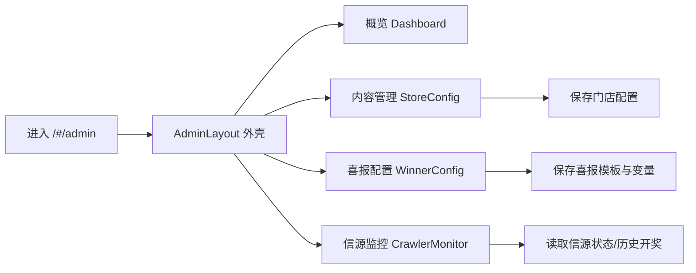

这一页只讲你从“后台入口”进入后，最先会用到的四个区域：**概览**、**内容管理**、**喜报配置**、**信源监控**。目标是让初学者先建立“我点哪里、看到什么、背后做了什么请求”的最小心智模型。  
Sources: [App.jsx](src/App.jsx#L42-L50), [AdminLayout.jsx](src/admin/AdminLayout.jsx#L15-L29)

你当前所在页面是目录中的 **[后台入口体验：概览、内容管理、喜报配置与监控入口](8-hou-tai-ru-kou-ti-yan-gai-lan-nei-rong-guan-li-xi-bao-pei-zhi-yu-jian-kong-ru-kou)**，属于“从零上手功能体验”阶段。  
Sources: [App.jsx](src/App.jsx#L42-L50)

## 1) 后台入口先看全景：路由 + 菜单如何对齐

后台主入口挂在 `/#/admin`，并在该路由下继续分出 `config`、`winner-config`、`crawler` 等子页；也就是说你在左侧菜单点击，本质上是在切换这些子路由。  
Sources: [App.jsx](src/App.jsx#L42-L50), [App.jsx](src/App.jsx#L73-L75)

菜单层面，系统先固定提供“概览 / 内容管理 / 喜报配置”，然后**仅在总站管理上下文**追加“分站管理 / 图片素材 / 信源监控 / 今日运势”，最后都有“系统设置”。这就是你会看到“有些账号有监控入口、有些没有”的直接原因。  
Sources: [AdminLayout.jsx](src/admin/AdminLayout.jsx#L11-L13), [AdminLayout.jsx](src/admin/AdminLayout.jsx#L15-L30)


Sources: [App.jsx](src/App.jsx#L42-L50), [AdminLayout.jsx](src/admin/AdminLayout.jsx#L15-L29), [Dashboard.jsx](src/admin/Dashboard.jsx#L16-L59), [StoreConfig.jsx](src/admin/StoreConfig.jsx#L334-L377), [WinnerConfig.jsx](src/admin/WinnerConfig.jsx#L175-L200), [CrawlerMonitor.jsx](src/admin/CrawlerMonitor.jsx#L38-L68)

## 2) 四个入口你会看到什么（新手视角）

| 入口 | 主要作用 | 典型请求 | 谁能看到 |
|---|---|---|---|
| 概览 | 看系统在线状态、门店/平台状态、快速操作 | `/api/health`、`/api/store/:id`、`/api/super/stores` | 总站与分站都可见（内容不同） |
| 内容管理 | 编辑门店基础信息、玩法配置、部分素材关联 | `/api/store/:id`、`/api/store/:id/scratch`、`/api/store/update` | 总站可全量，分站有受限写入 |
| 喜报配置 | 管理模板、变量选项、门店展示喜报列表 | `/api/system/winner-config`、`/api/system/sources` | 页面可进；中心模板保存需 superKey |
| 信源监控 | 看抓取状态、历史开奖、手动刷新、定时抓取配置 | `/api/system/sources`、`/api/system/sources/refresh`、`/api/system/draw-history` | 仅总站菜单开放 |

Sources: [Dashboard.jsx](src/admin/Dashboard.jsx#L16-L59), [StoreConfig.jsx](src/admin/StoreConfig.jsx#L180-L196), [StoreConfig.jsx](src/admin/StoreConfig.jsx#L334-L377), [WinnerConfig.jsx](src/admin/WinnerConfig.jsx#L50-L72), [WinnerConfig.jsx](src/admin/WinnerConfig.jsx#L175-L200), [CrawlerMonitor.jsx](src/admin/CrawlerMonitor.jsx#L38-L68), [CrawlerMonitor.jsx](src/admin/CrawlerMonitor.jsx#L163-L180), [AdminLayout.jsx](src/admin/AdminLayout.jsx#L22-L27)

## 3) 概览页：先确认“系统活着”

概览页加载时会先探测 `/api/health`，再按上下文拉门店信息或平台门店列表，所以它是后台第一道“运行体检页”。新手建议先看这里是否在线，再去做配置。  
Sources: [Dashboard.jsx](src/admin/Dashboard.jsx#L16-L39), [Dashboard.jsx](src/admin/Dashboard.jsx#L45-L59)

UI 上它会把结果汇总成状态卡片与快速入口：总站可以“预览主站、管理分站清单”，分站则直达“预览当前站点内容”。这让你能在改配置前后快速做前台对照。  
Sources: [Dashboard.jsx](src/admin/Dashboard.jsx#L75-L83), [Dashboard.jsx](src/admin/Dashboard.jsx#L125-L137)

## 4) 内容管理：编辑入口与保存边界

内容管理页（StoreConfig）加载时会并行取三类数据：门店基础配置、刮刮乐配置、全局素材库（有 superKey 时），这是它首次进入可能稍慢但信息完整的原因。  
Sources: [StoreConfig.jsx](src/admin/StoreConfig.jsx#L180-L196), [StoreConfig.jsx](src/admin/StoreConfig.jsx#L225-L244)

它会对联系人与电话做规范化（如中文姓氏+称呼、11位电话），并在提交前校验；分站模式下还会限制可保存内容，避免门店侧改动省中心统一项。  
Sources: [StoreConfig.jsx](src/admin/StoreConfig.jsx#L201-L219), [StoreConfig.jsx](src/admin/StoreConfig.jsx#L255-L319), [StoreConfig.jsx](src/admin/StoreConfig.jsx#L334-L364)

最终保存统一走 `/api/store/update`，携带 `id/adminKey/superKey/config` 结构；你可把它理解为“门店配置总提交口”。  
Sources: [StoreConfig.jsx](src/admin/StoreConfig.jsx#L366-L377)

## 5) 喜报配置：模板中心 + 门店实例

喜报配置页进入后会同时读取“系统喜报配置”和“信源数据”，并把信源中的可用喜报语句并入变量选项，保证模板变量来源与实时信源对齐。  
Sources: [WinnerConfig.jsx](src/admin/WinnerConfig.jsx#L55-L59), [WinnerConfig.jsx](src/admin/WinnerConfig.jsx#L72-L88), [WinnerConfig.jsx](src/admin/WinnerConfig.jsx#L90-L103)

在总站且门店还没有历史喜报时，页面会用 `preset_line` 预置若干条作为初始展示；这就是为什么新环境里你一进页面也能先看到示例内容。  
Sources: [WinnerConfig.jsx](src/admin/WinnerConfig.jsx#L104-L124)

保存“中心模板/变量选项”要求 superKey；没有 superKey 会直接提示权限不足。这条规则是后台体验里最重要的权限分界之一。  
Sources: [WinnerConfig.jsx](src/admin/WinnerConfig.jsx#L175-L180), [WinnerConfig.jsx](src/admin/WinnerConfig.jsx#L194-L200)

## 6) 监控入口：看抓取、改节奏、手动刷新

监控页会先加载 `/api/system/sources` 与历史开奖；若发现状态是 `uninitialized`，会自动触发刷新。对新手而言，这意味着“第一次空数据不一定是坏了，可能是还没初始化抓取”。  
Sources: [CrawlerMonitor.jsx](src/admin/CrawlerMonitor.jsx#L38-L50), [CrawlerMonitor.jsx](src/admin/CrawlerMonitor.jsx#L54-L68)

该页还支持读取/保存超级配置（如展示条数、滚动停留时长）与定时抓取 cron 配置，保存接口都走 `/api/super/update-config`。  
Sources: [CrawlerMonitor.jsx](src/admin/CrawlerMonitor.jsx#L70-L91), [CrawlerMonitor.jsx](src/admin/CrawlerMonitor.jsx#L93-L123), [CrawlerMonitor.jsx](src/admin/CrawlerMonitor.jsx#L134-L161)

可视化上它提供信源状态卡、福建玩法状态卡、以及历史开奖表格，是后台里最接近“运维观察台”的页面。  
Sources: [CrawlerMonitor.jsx](src/admin/CrawlerMonitor.jsx#L543-L561), [CrawlerMonitor.jsx](src/admin/CrawlerMonitor.jsx#L564-L588), [CrawlerMonitor.jsx](src/admin/CrawlerMonitor.jsx#L669-L719)

## 7) 后台入口相关文件速览（只看本页范围）

```text
src/
  App.jsx                    # 后台路由挂载（/admin 下各入口）
  admin/
    AdminLayout.jsx          # 左侧菜单、鉴权、上下文切换
    Dashboard.jsx            # 概览
    StoreConfig.jsx          # 内容管理
    WinnerConfig.jsx         # 喜报配置
    CrawlerMonitor.jsx       # 监控入口
```
Sources: [App.jsx](src/App.jsx#L42-L50), [AdminLayout.jsx](src/admin/AdminLayout.jsx#L15-L29), [Dashboard.jsx](src/admin/Dashboard.jsx#L4-L10), [StoreConfig.jsx](src/admin/StoreConfig.jsx#L34-L43), [WinnerConfig.jsx](src/admin/WinnerConfig.jsx#L20-L27), [CrawlerMonitor.jsx](src/admin/CrawlerMonitor.jsx#L4-L12)

## 8) 建议你的下一步阅读路径

如果你刚完成本页，建议按这个顺序继续：先看权限与框架，再深入监控与内容运营模块，最后再看后端实现细节。  
Sources: [AdminLayout.jsx](src/admin/AdminLayout.jsx#L36-L65), [AdminLayout.jsx](src/admin/AdminLayout.jsx#L79-L119), [CrawlerMonitor.jsx](src/admin/CrawlerMonitor.jsx#L38-L68), [StoreConfig.jsx](src/admin/StoreConfig.jsx#L334-L377)

- [后台框架设计：菜单分层、主站特权页与分站登录鉴权](20-hou-tai-kuang-jia-she-ji-cai-dan-fen-ceng-zhu-zhan-te-quan-ye-yu-fen-zhan-deng-lu-jian-quan)  
- [会话与安全控制：分站密钥登录、超时失效与活动追踪](21-hui-hua-yu-an-quan-kong-zhi-fen-zhan-mi-yao-deng-lu-chao-shi-shi-xiao-yu-huo-dong-zhui-zong)  
- [抓取监控中心：信源状态、历史抓取、配置下发与手动刷新](22-zhua-qu-jian-kong-zhong-xin-xin-yuan-zhuang-tai-li-shi-zhua-qu-pei-zhi-xia-fa-yu-shou-dong-shua-xin)  
- [内容运营模块：门店配置、喜报配置、布局素材与运势管理](23-nei-rong-yun-ying-mo-kuai-men-dian-pei-zhi-xi-bao-pei-zhi-bu-ju-su-cai-yu-yun-shi-guan-li)