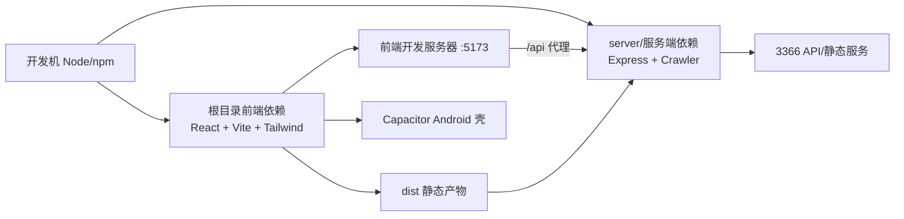

本页聚焦“运行前置环境”本身：你需要准备哪一类 Node 运行时、前端与服务端各自依赖如何分层、以及当前仓库里已经出现的兼容性信号（例如模块制式与 Express 主版本差异）。它不展开部署发布细节，也不展开业务架构。  
Sources: [package.json](package.json#L1-L49), [server/package.json](server/package.json#L1-L24), [server/index.js](server/index.js#L1-L17)

---

## 1) 先建立环境认知：这是“双 Node 域 + 一套移动壳”的工程

从依赖声明可以确认：仓库根目录是 **Vite + React 前端工程**（含 Tailwind、ESLint、Capacitor），而 `server/` 是 **独立 Node 服务**（Express 4 + CJS），二者各有自己的 `package.json` 与 lock 文件，意味着安装与排障应按“两套依赖域”处理。  
Sources: [package.json](package.json#L1-L49), [package-lock.json](package-lock.json#L1-L46), [server/package.json](server/package.json#L1-L24), [server/package-lock.json](server/package-lock.json#L1-L23)



上图对应到配置层：Vite 开发服务器把 `/api` 代理到 `127.0.0.1:3366`，而服务端默认端口也是 `3366`，所以联调的关键是“前端 dev server + server 进程同时可用”。  
Sources: [vite.config.js](vite.config.js#L26-L35), [server/index.js](server/index.js#L133-L137)

---

## 2) 依赖相关目录可视图（只看本页需要的最小集合）

```text
.
├─ package.json                 # 前端与通用依赖（ESM）
├─ package-lock.json
├─ vite.config.js               # 前端兼容目标与 /api 代理
├─ postcss.config.js
├─ tailwind.config.js
├─ capacitor.config.json        # 移动壳 webDir/server.url
├─ android/                     # Android 构建链
│  ├─ build.gradle
│  ├─ app/build.gradle
│  ├─ variables.gradle
│  └─ gradle/wrapper/gradle-wrapper.properties
└─ server/
   ├─ package.json              # 服务端依赖（CJS）
   ├─ package-lock.json
   ├─ index.js
   └─ crawler.js
```

这个结构意味着：排查“依赖安装问题”时，不要只看根目录，还要单独进入 `server/`；排查“移动端构建问题”时要切到 `android/` 的 Gradle 体系。  
Sources: [package.json](package.json#L1-L49), [server/package.json](server/package.json#L1-L24), [android/build.gradle](android/build.gradle#L1-L30), [android/app/build.gradle](android/app/build.gradle#L1-L55)

---

## 3) Node 与包管理器基线（可验证事实）

仓库中出现了两个明确 Node 版本信号：`deploy/setup.sh` 安装 Node 18.x，而 GitHub Action 使用 Node 20 跑抓取脚本；同时 lockfileVersion 为 3（根目录与 server 一致）。这说明项目在实践中至少覆盖 Node 18/20 两个运行档位。  
Sources: [deploy/setup.sh](deploy/setup.sh#L10-L13), [.github/workflows/fetch-lottery.yml](.github/workflows/fetch-lottery.yml#L20-L27), [package-lock.json](package-lock.json#L1-L5), [server/package-lock.json](server/package-lock.json#L1-L5)

---

## 4) 前端依赖面：运行、构建、兼容三层

前端运行核心为 React 19 + React Router 7，构建链为 Vite 7 + React 插件；样式链为 Tailwind 4 + PostCSS + autoprefixer；同时启用 `@vitejs/plugin-legacy`，并显式声明 Chrome 61 / Android 7 / iOS 12 等目标，且 `cssTarget` 固定为 `chrome61`。  
Sources: [package.json](package.json#L27-L47), [vite.config.js](vite.config.js#L7-L25), [postcss.config.js](postcss.config.js#L1-L7), [tailwind.config.js](tailwind.config.js#L1-L12)

此外，根包 `type: "module"` 说明根目录脚本按 ESM 语义执行；你在根目录新增 Node 脚本时要优先按 ESM 组织，避免与 CommonJS 写法混用导致运行时异常。  
Sources: [package.json](package.json#L5-L11)

---

## 5) 服务端依赖面：Express API + 抓取能力

`server/` 依赖集中于 Express、axios、multer、node-cron、qrcode、compression，脚本入口是 `node index.js`；源码中 `require(...)` 全面采用 CommonJS，且服务监听 `PORT || 3366`。  
Sources: [server/package.json](server/package.json#L6-L22), [server/index.js](server/index.js#L1-L17), [server/index.js](server/index.js#L133-L143)

抓取侧依赖已在服务代码内落地：`crawler.js` 明确使用 puppeteer + cheerio + axios，并处理远程站点数据抓取，这类依赖通常对运行环境的网络与系统库更敏感。  
Sources: [server/crawler.js](server/crawler.js#L1-L5), [server/crawler.js](server/crawler.js#L48-L61), [server/crawler.js](server/crawler.js#L149-L158)

---

## 6) 常见兼容点（按“可见证据 → 影响”整理）

| 兼容点 | 证据 | 直接影响 | 建议动作 |
|---|---|---|---|
| 根目录 ESM vs server CJS | 根目录 `type: module`；server 使用 `require` | 跨目录复用脚本时，模块制式可能冲突 | 新脚本放哪就遵循哪套模块制式 |
| Express 主版本不一致 | 根依赖 `express@5.2.1`；server 依赖 `express@4.18.2` | 若误在根目录启动服务脚本，可能踩 API 行为差异 | 服务端依赖与启动统一在 `server/` |
| 前后端联调端口耦合 | Vite `/api` 代理到 `127.0.0.1:3366`；server 默认 3366 | server 未启动或端口变更会导致前端 API 失败 | 修改端口时同步改 proxy 与 server |
| 旧内核兼容策略已启用 | legacy targets + `cssTarget: chrome61` | 构建偏向兼容性而非最小体积 | 保持该配置，避免随意移除 legacy |
| Android 构建链版本固定 | AGP 8.13.0、Gradle 8.14.3、minSdk 24、target 36 | Android 构建需与该链路匹配 | 出现构建异常优先核对这些版本 |
| Capacitor 以远程 URL 运行 | `webDir: dist` 且 `server.url` 指向 HTTP 地址并 `cleartext: true` | 移动壳可能优先加载远程地址 | 联调时确认是否本地静态包模式 |

Sources: [package.json](package.json#L5-L20), [server/package.json](server/package.json#L10-L15), [vite.config.js](vite.config.js#L9-L35), [android/build.gradle](android/build.gradle#L9-L12), [android/gradle/wrapper/gradle-wrapper.properties](android/gradle/wrapper/gradle-wrapper.properties#L1-L8), [android/variables.gradle](android/variables.gradle#L1-L16), [capacitor.config.json](capacitor.config.json#L1-L9)

---

## 7) 最小可用环境检查（中级开发者版）

建议按顺序验证：先安装根依赖并确认 `vite` 可启动，再安装 `server/` 依赖并确认 `node index.js` 可监听 3366，最后再做前后端联调（看 `/api` 是否经由 Vite 代理命中服务端）。  
Sources: [package.json](package.json#L6-L11), [server/package.json](server/package.json#L6-L9), [vite.config.js](vite.config.js#L26-L35), [server/index.js](server/index.js#L135-L143)

---

## 8) 下一步阅读建议（按目录顺序）

完成本页后，建议先读 [构建与发布基础：静态资源构建、服务端静态托管与缓存策略认知](10-gou-jian-yu-fa-bu-ji-chu-jing-tai-zi-yuan-gou-jian-fu-wu-duan-jing-tai-tuo-guan-yu-huan-cun-ce-lue-ren-zhi)，再读 [Android/Capacitor 打包入口与移动端运行模式说明](11-android-capacitor-da-bao-ru-kou-yu-yi-dong-duan-yun-xing-mo-shi-shuo-ming)；若你还没做过本地联调，可回看 [本地开发工作流：Vite 前端调试、Node 服务启动与联调方式](4-ben-di-kai-fa-gong-zuo-liu-vite-qian-duan-diao-shi-node-fu-wu-qi-dong-yu-lian-diao-fang-shi)。